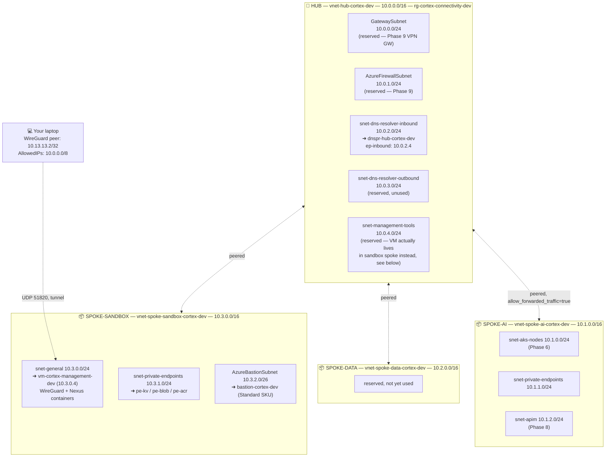
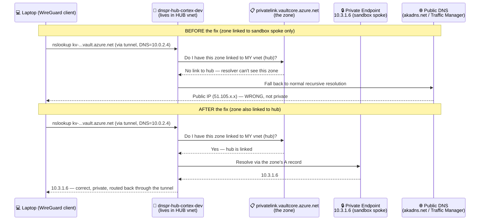
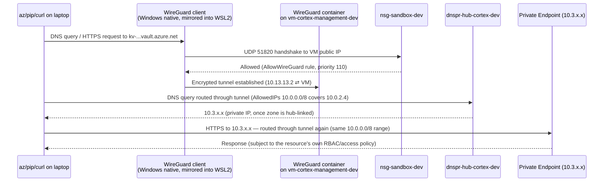
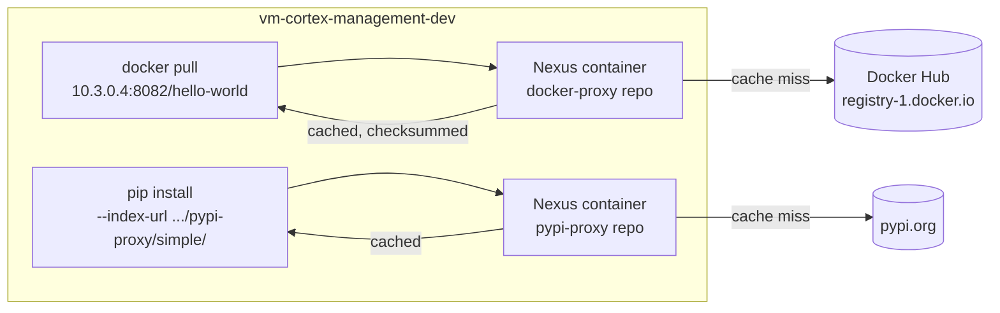
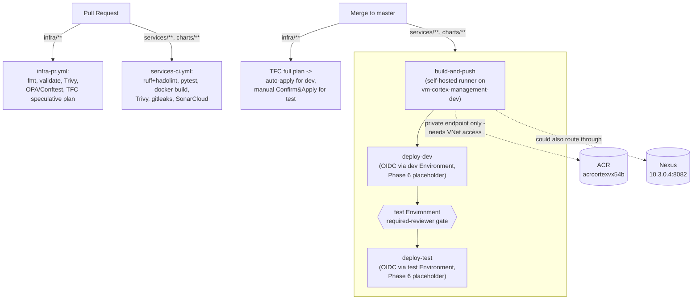
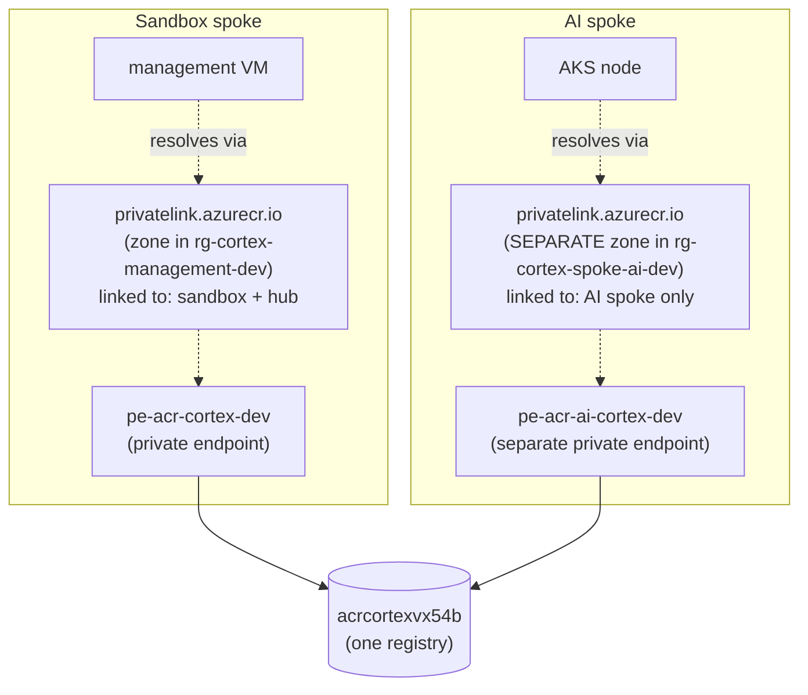

# Cortex AI POC — Tutorial & Interview Notes

Living, append-only notes. One section per phase: **Concept** (plain-terms
explanation), **What we built** (and why), **Interview tips** (likely
questions + our comprehension-check answers). Never edit a past phase's
section — only add to it if we revisit that topic later.

## Contents
*(Explicit anchor IDs, not auto-generated header slugs — GitHub and your
editor's markdown preview slugify punctuation like em-dashes differently,
so auto-slugs only work reliably in one renderer at a time. These `<a
id="...">` tags right before each heading work in both.)*
- [Phase 0 — Tooling, login, repo scaffold, remote TF state](#phase-0)
  - [Phase 0 — Complete: What We Actually Built End-to-End](#phase-0-complete)
- [Phase 0b — Azure OIDC bootstrap for HCP Terraform](#phase-0b)
- [Phase 0c — Management group](#phase-0c)
- [Phase 0d — Bank-scale landing zone: full MG hierarchy + hub-and-spoke networking](#phase-0d)
- [Phase 1 — Complete: Networking, Azure Policy, CI/CD pipeline](#phase-1-complete)
- [Phase 2 — IAM](#phase-2)
  - [Phase 2 — Complete: IAM](#phase-2-complete)
- [Phase 3 — VM, SSH key, Key Vault, ACR, Nexus, WireGuard](#phase-3)
  - [Phase 3 — Complete: Platform Foundation](#phase-3-complete)
  - [Phase 3 — Addendum: what actually happened getting Bastion working](#phase-3-addendum)
- [Phase 4 — Complete: Networking Deep-Dive, Nexus, and the Console Skeleton](#phase-4-complete)
- [Phase 5 — Complete: CI/CD Pipelines](#phase-5-complete)
- [Phase 6 — Complete: AKS + Helm + Real Deploys](#phase-6-complete)
- Phase 7 — Entra SSO + client-credentials flow (not started)
- Phase 8 — Foundry + Guardrails + APIM (not started)
- Phase 9 — Private endpoints + Firewall + WAF + VPN Gateway (not started)
- Phase 10 — Observability (not started)
- Phase 11 — Teardown + summary (not started)

---

## Phase 0

### Concept
- An **Azure subscription** is the billing/scope boundary; a **resource
  group** is a logical container inside it that everything gets tagged and
  deleted together as. We haven't created either yet in this phase — Phase
  0 is just local scaffolding.
- **Terraform state** is Terraform's record of what it thinks exists in the
  real world. If two people (or two runs) write state at the same time
  without locking, you get corruption or drift. Keeping state **remote**
  (not a file on your laptop) and **locked** is the fix.
- **HCP Terraform (Terraform Cloud)** is a hosted backend: it stores state,
  locks it during runs, and — critically for our teaching rule of never
  auto-applying — makes you click "Confirm & Apply" in its UI/CLI before
  anything is created. That's a built-in safety net, not something we have
  to bolt on ourselves.
- A **Terraform Cloud workspace** is not the same thing as a local
  `terraform workspace` (a state-file switch within one config) — a TFC
  workspace is a whole separate execution context (its own variables,
  state, run history) tied to one working directory. `cortex-ai-dev` and
  `cortex-ai-test` are two TFC workspaces, one per environment.
- We chose TFC over a hand-bootstrapped Azure Storage Account backend
  because it also gives us the manual-approval gate and run history for
  free, and the user already had a TFC account set up.

### What we built
- Repo layout matching CLAUDE.md's structure (not the flatter layout the
  original source plan suggested):
  `infra/modules/{network,foundry,apim,aks,keyvault,nexus,observability}/`,
  `infra/envs/{dev,test,prod}/` (prod intentionally empty),
  `services/console/`, `charts/console/`, `policy/{opa,guardrails}/`,
  `docs/adr/`, `.github/workflows/`.
- Each module/env folder got a README stating its purpose and which future
  phase builds it — so the empty scaffold is still legible.
- `docs/adr/0001-poc-scope.md` records the scope decisions (dev+test only,
  HCP Terraform from day one, Nexus deferred to Phase 3, everything else
  in CLAUDE.md stays in force).
- This file (`docs/TUTORIAL.md`) itself.
- Tooling check found `terraform` (v1.15.8) and `gh` already installed;
  `az`, `docker`, `kubectl`, `helm` are missing on this machine and need to
  be installed before later phases (see chat for install commands — not
  run automatically, since installing system packages needs your sudo
  approval).
- `infra/envs/dev/backend.tf` / `infra/envs/test/backend.tf` (added once
  the TFC org name was confirmed) point at the `cortex-ai-dev` /
  `cortex-ai-test` workspaces via a `cloud {}` block.

### Interview tips
- **"Why remote state?"** — avoid local state loss/corruption, enable
  locking so concurrent runs don't race, enable team/CI access without
  passing a state file around.
- **"local terraform workspace vs Terraform Cloud workspace — what's the
  difference?"** — a classic trip-up. Local workspace = a named state
  file within one config directory. TFC workspace = an entire separate
  run/state/variable context, usually one per environment or component.
- **"plan vs apply"** — plan is a dry-run diff against current state;
  apply executes it. Never skip reading the plan.
- **"Why HCP Terraform over a storage-account backend?"** — storage
  account backend gives you state + locking only; TFC additionally gives
  you a hosted run history, a manual approval gate, and (later, if
  needed) policy-as-code via Sentinel — useful even for a solo lab because
  it enforces the "always review before apply" habit structurally.

### Comprehension check (answer before Phase 1)
1. What's the difference between a local `terraform workspace` and a
   Terraform Cloud workspace?
2. Why do we keep Terraform state remote and locked, even on a solo
   two-day project with no teammates?

---

## Phase 0b

### Concept
- HCP Terraform runs execute on HashiCorp's infrastructure, not yours —
  they need their own way to prove their identity to Azure. **Dynamic
  credentials** (HCP Terraform's OIDC workload identity federation) issue
  a short-lived Azure token per run instead of using a stored client
  secret.
- The trust is a one-way statement configured on an Entra ID **App
  Registration**: "trust OIDC tokens issued by `https://app.terraform.io`
  whose `subject` claim matches this exact TFC organization/project/
  workspace/run-phase." That's a **Federated Identity Credential**.
- Each *run phase* (`plan`, `apply`) gets its own federated credential
  because the subject claim includes `run_phase` — so you need 2 per
  workspace, 4 total for dev+test.
- **App Registration vs Managed Identity**, revisited: a managed identity
  is for an Azure-hosted resource proving its own identity *to* Azure; an
  app registration + federated credential is for an **external** OIDC
  issuer (TFC, GitHub Actions, etc.) proving identity *into* Azure. Same
  underlying OAuth client-credentials-style flow, different direction.
- **Least privilege via scope, not just role**: the SPN gets `Contributor`
  — a fairly broad role — but scoped to *one resource group only*, not
  the subscription. Blast radius if the dev credential were ever misused
  is capped to `rg-cortex-ai-dev`.
- Chicken-and-egg problem: TFC can't create the very credential it needs
  to authenticate to Azure. So this bootstrap runs with **local state**,
  authenticated as you via `az login` — a deliberate, documented exception
  to "everything is a TFC-managed workspace," same shape as the ADR 0001
  scope-decision pattern.

### What we built
- `infra/bootstrap/tfc-oidc/` — a small local-state Terraform config
  (`azuread` + `azurerm` providers) creating, per env: one
  `azuread_application` + `azuread_service_principal`, two
  `azuread_application_federated_identity_credential` (plan + apply), and
  one `azurerm_role_assignment` (Contributor, scoped to that env's RG,
  looked up via a `data "azurerm_resource_group"` — never created/owned
  by this bootstrap).
- Decision: **two separate app registrations** (`cortex-ai-tfc-dev`,
  `cortex-ai-tfc-test`), not one shared app with two credentials — keeps
  dev and test credentials fully independent.
- Decision: resource groups `rg-cortex-ai-dev` / `rg-cortex-ai-test` are
  pre-created manually via `az group create` (documented in the
  bootstrap's README) — the RG boundary is the manual exception, Terraform
  owns everything inside it.
- Validated locally (`terraform fmt`, `init -backend=false`, `validate`) —
  not applied yet; that's a real-Azure-resource step for you to run and
  review, per the "never auto-apply" rule.

### Interview tips
- **"Why not just use a client secret?"** — secrets need rotation, can
  leak in logs/CI config, and are a standing credential that works from
  anywhere. A federated credential only exchanges for a token when a
  request arrives with a token from the *exact* trusted issuer+subject —
  nothing to leak, nothing to rotate.
- **"What's in the subject claim and why does it matter?"** —
  `organization:<org>:project:<project>:workspace:<workspace>:run_phase:<plan|apply>`
  — it's how Azure knows this token request came from *this specific*
  workspace's *this specific* run phase, not just "some TFC run somewhere."
- **"Why scope Contributor to a resource group instead of the
  subscription?"** — least privilege / blast-radius containment; a classic
  security-review question.
- **Comprehension check answers (recap):** local `terraform workspace` =
  a state-file switch within one config dir; TFC workspace = a whole
  separate run/state/variable context. Remote+locked state matters solo
  too, in case you run from two machines/sessions or a run gets
  interrupted mid-write.

### Comprehension check (answer before Phase 1)
1. Why does each TFC run *phase* (plan vs apply) need its own federated
   credential, rather than one shared credential per workspace?
2. If someone got hold of the `cortex-ai-tfc-dev` service principal's
   token, what's the actual blast radius, and why?

---

## Phase 0c

### Concept
- **Management groups** sit above subscriptions in Azure's scope hierarchy:
  `Tenant Root Group` → management group(s) → subscriptions → resource
  groups → resources. Azure Policy and RBAC assigned at a management group
  **inherit down** to every subscription/RG/resource beneath it — the whole
  point is applying governance once instead of per-subscription.
- This is the real shape of a bank-scale "landing zone" (Cloud Adoption
  Framework pattern): `Platform` / `Landing Zones` / `Sandbox` /
  `Decommissioned` management groups, with **prod living in its own
  subscription** for hard billing/quota/compliance isolation from
  dev/test.
- **Entra ID roles vs Azure RBAC are two separate systems.** Being Global
  Administrator (an Entra ID role, about identity/tenant administration)
  does **not** automatically grant you any Azure RBAC role (about
  resource access). "Elevate access" is the documented, auditable bridge:
  a Global Admin can grant themselves `User Access Administrator` at the
  tenant root scope (`/`) specifically to bootstrap Azure RBAC/management
  groups. We hit exactly this gap (`AuthorizationFailed` reading
  management groups) before elevating.
- We built **one** management group hierarchy and placed the subscription
  under `mg-cortex-corp` (Landing Zones → Corp) — not Sandbox. The
  subscription runs a real project with private VNet connectivity; that
  makes it a Corp landing zone, not a sandbox. `mg-cortex-sandbox` exists
  in the hierarchy to show the tier and would hold a throwaway dev sub in
  production, but holds nothing in this POC.
- In a real bank there would be **separate subscriptions** for each concern:
  `sub-cortex-ai` under `mg-cortex-corp`, `sub-connectivity` under
  `mg-cortex-connectivity`, `sub-management` under `mg-cortex-management`.
  With one subscription we simulate that boundary through resource group
  naming (`rg-cortex-connectivity-*`, `rg-cortex-ai-*`) and document the
  gap explicitly.

### What we built
- Elevated access once (Entra ID toggle or `az rest ... elevateAccess`)
  to get `User Access Administrator` at tenant root — fixing the earlier
  `AuthorizationFailed` on `az account management-group list`.
- `infra/bootstrap/management-group/` — local-state Terraform
  (`azurerm_management_group` + `azurerm_management_group_subscription_association`)
  placing the existing subscription under `mg-cortex-ai`, directly beneath
  the tenant root group.
- Documented, not built: the multi-tier CAF hierarchy and a
  prod-only subscription — recorded as the production design in the
  bootstrap README.

### Interview tips
- **"What's the Azure scope hierarchy?"** — tenant root group →
  management groups (nested up to 6 levels) → subscriptions → resource
  groups → resources. Policy/RBAC assigned higher flows down.
- **"Why would a bank put prod in its own subscription instead of just a
  resource group?"** — subscriptions are the hard boundary for billing,
  regional/service quotas, and often compliance scope — resource groups
  don't give you that.
- **"Difference between Entra ID roles and Azure RBAC roles?"** — Entra
  ID roles (Global Admin, User Admin, etc.) govern the *directory*
  (users, groups, apps); Azure RBAC roles (Owner, Contributor, User
  Access Administrator) govern *Azure resource* access. Elevate access is
  the audited, one-directional bridge from the former to the latter.

### Comprehension check (answer before Phase 1)
1. Why doesn't being an Entra ID Global Administrator automatically let
   you manage management groups or assign Azure RBAC roles?
2. What real problem does putting prod in a separate subscription (under
   a `Landing Zones` management group) solve that a resource group
   can't?

---

## Phase 0d

### Concept — Bank-scale Azure landing zone: management groups + networking

#### Management group hierarchy (what a bank actually looks like)
```
Tenant Root Group
└── mg-cortex-ai           (our root — bank: company root)
    ├── mg-platform        (shared services, operated by platform team)
    │   ├── mg-connectivity  hub VNet, firewall, VPN/ER gateway, DNS resolver
    │   ├── mg-management    SonarQube, Aqua/Trivy, Nexus, Log Analytics, Defender
    │   └── mg-identity      Entra Connect, PKI/CAs, Key Vault roots
    ├── mg-landingzones    (workload subscriptions vended by the platform team)
    │   ├── mg-corp          private, VNet-connected — AI platform, data platform
    │   └── mg-online        internet-facing services, separate ingress policy
    ├── mg-sandbox         (dev/lab, relaxed policy — your subscription lives here)
    └── mg-decommissioned  (retiring subs get moved here; Deny policy kicks in)
```

**Why this structure?** Azure Policy and RBAC assigned at a management group
inherit down automatically. If you put "require private endpoints on all
storage accounts" at `mg-landingzones`, it applies to every subscription
under Corp and Online without re-assigning it per-subscription.
`mg-sandbox` can have a looser policy so developers can experiment without
triggering prod-grade controls.

#### On networking: hub-and-spoke (not per-platform, not flat)

**The question was: do we create one network per platform service, or one
for the whole tenant?** The bank answer is neither extreme — it's
**hub-and-spoke**:

- **Hub** (lives in the Connectivity subscription / `mg-connectivity`):
  one VNet per region containing: Azure Firewall, VPN/ExpressRoute Gateway,
  Azure DNS Private Resolver, and private DNS zones for every PaaS service
  family. This is the single choke-point for all traffic crossing platform
  boundaries or leaving to the internet/on-prem.
- **Spoke** (one per workload, in its own subscription under `mg-corp`):
  AI platform gets `vnet-spoke-ai`; data platform gets `vnet-spoke-data`.
  Each spoke peers to the hub — never directly to each other (spoke-to-spoke
  is blocked unless the firewall explicitly allows it).
- **Why not flat (one big VNet)?** No isolation. A misconfigured data
  platform pod can reach AI platform resources directly. No audit log of
  cross-platform traffic.
- **Why not fully separate per-platform?** Shared services (ExpressRoute
  costs £10k+/month, DNS zones need to be authoritative once for a given
  domain) cannot be duplicated cheaply. VPN/gateway transit is shared
  through the hub.

#### DNS: centralized, not per-spoke
All private DNS zones live in the Connectivity hub. The DNS Private Resolver
in the hub receives DNS queries from all spokes (spokes' custom DNS server =
resolver inbound endpoint IP). This means adding a private endpoint in any
spoke automatically resolves from the correct zone — no per-spoke zone
duplication, no split-brain.

#### Where shared tools (SonarQube, Aqua, Nexus) sit
In the Management subscription (`mg-management`), on the
`snet-management-tools` subnet in the hub (or a dedicated spoke peered to
the hub). Every team's pipeline reaches them through the hub firewall.
For the POC we run Nexus OSS via Docker Compose on the same VM in
`snet-management-tools`.

#### What the CIDR plan looks like (ours)
```
10.0.0.0/16  hub (rg-cortex-connectivity-dev)
  10.0.0.0/24  GatewaySubnet        (name fixed by Azure — VPN/ER gateway)
  10.0.1.0/24  AzureFirewallSubnet  (name fixed by Azure — Firewall)
  10.0.2.0/24  snet-dns-resolver-inbound
  10.0.3.0/24  snet-dns-resolver-outbound
  10.0.4.0/24  snet-management-tools (Nexus, SonarQube, Aqua)

10.1.0.0/16  spoke-ai   (rg-cortex-spoke-ai-dev)
  10.1.0.0/24  aks-nodes
  10.1.1.0/24  private-endpoints
  10.1.2.0/24  apim

10.2.0.0/16  spoke-data (rg-cortex-spoke-data-dev)
10.3.0.0/16  spoke-sandbox
```

### What we built
- Expanded `infra/bootstrap/management-group/` from one MG to the full
  10-MG CAF hierarchy (root → platform/{connectivity,management,identity},
  landingzones/{corp,online}, sandbox, decommissioned). The subscription
  is placed in `mg-sandbox` — correctly reflecting what it is.
- `infra/bootstrap/hub-network/` — hub VNet + all required subnets
  (GatewaySubnet, AzureFirewallSubnet, DNS resolver inbound/outbound,
  management-tools), three spoke VNets (ai, data, sandbox), bidirectional
  VNet peering hub↔each spoke, and an Azure DNS Private Resolver with an
  inbound endpoint in the hub — all in one local-state bootstrap config.
- **Lab-vs-production gap explicitly flagged:**
  - `use_remote_gateways = false` on spoke→hub peering (no real VPN/ER
    gateway yet; flip to `true` in production when the gateway lands).
  - No Azure Firewall resource yet (costly ~£1/hr+); its subnet exists and
    a UDR pointing `0.0.0.0/0` at the firewall private IP would be the next
    step in production (Phase 9 material).
  - No Azure Policy assignments yet — MG hierarchy is the foundation;
    policies land in later phases.

### Interview tips
- **"How do you structure Azure networking at scale?"** — hub-and-spoke.
  Connectivity subscription owns the hub (firewall, gateway, DNS); each
  workload subscription gets a spoke VNet peered to it. Traffic between
  platforms goes through the firewall for inspection, not directly.
- **"Why is DNS centralized?"** — private DNS zones need to be authoritative
  once per domain. If you duplicate them per-spoke they can diverge. The
  DNS Private Resolver in the hub means all spokes resolve consistently
  without needing a DNS server VM.
- **"What are GatewaySubnet and AzureFirewallSubnet?"** — subnet names
  that Azure requires to be exact strings for the respective services. A
  common exam/interview gotcha.
- **"What does `allow_gateway_transit = true` on the hub peering do?"** —
  it lets spoke VNets use the hub's VPN/ER gateway for on-prem connectivity
  without each spoke needing its own (very expensive) gateway.
- **"Subscription as a blast-radius boundary — explain."** — subscriptions
  have hard limits (resource quotas, billing, policy scope). A compromise
  of one workload subscription can't consume another subscription's quota
  or affect its billing. Resource groups don't give that.

### Comprehension check (answer before Phase 1)
1. A data platform team adds a private endpoint for their storage account
   in `vnet-spoke-data`. How does a pod in `vnet-spoke-ai` resolve its
   private DNS name, given the DNS resolver is only in the hub?
2. You have Azure Firewall in the hub but spoke-to-spoke traffic is still
   flowing directly. What configuration step is missing?

---

<a id="phase-0-complete"></a>
## Phase 0 — Complete: What We Actually Built End-to-End

> This section covers everything that happened across Phase 0a–0d in
> execution order: what the goal was, what we coded, gotchas we hit and
> why, and the resulting live state. Read this before Phase 1.

---

### The full picture in one diagram

```
GitHub repo (avilash87/cortex-ai)   ← your source of truth
  │
  ├─ infra/bootstrap/tfc-cloud-setup/   ← LOCAL state (chicken-and-egg)
  │     ↓ terraform apply
  │     ├── Entra ID App Registrations: cortex-ai-tfc-dev, cortex-ai-tfc-test
  │     ├── Federated Identity Credentials (plan + apply × 2 workspaces)
  │     ├── Contributor role on subscription (scoped)
  │     ├── TFC workspaces cortex-ai-dev / cortex-ai-test (VCS-driven, auto-apply OFF)
  │     ├── TFC workspace env vars (TFC_AZURE_PROVIDER_AUTH, ARM_*, etc.)
  │     └── GitHub OAuth VCS connection (HCP Terraform ↔ GitHub)
  │
  ├─ infra/bootstrap/management-group/  ← LOCAL state
  │     ↓ terraform apply
  │     ├── 10 management groups (full CAF hierarchy)
  │     ├── Subscription under mg-cortex-corp
  │     └── rg-cortex-ai-dev, rg-cortex-ai-test (landing zone RGs)
  │
  ├─ infra/bootstrap/hub-network/       ← LOCAL state
  │     ↓ terraform apply
  │     ├── vnet-hub-cortex-dev (10.0.0.0/16)
  │     ├── 3 spoke VNets: ai / data / sandbox
  │     ├── Hub ↔ spoke VNet peerings (bidirectional)
  │     ├── Azure DNS Private Resolver + inbound endpoint
  │     ├── rg-cortex-management-dev (empty shell for Phase 10)
  │     └── £50/month subscription budget with 80% + forecast alerts
  │
  └─ infra/envs/dev/   ← TFC REMOTE state (cortex-ai-dev workspace)
        ↓ terraform plan (runs in TFC)
        Empty plan — no Azure auth errors = OIDC wired correctly ✓
```

---

### Why three separate local-state bootstraps?

**The chicken-and-egg problem:** Normal Terraform uses TFC as the state backend.
But TFC needs Azure credentials to do anything, the Azure credentials need an
Entra app registration, and creating Entra objects *requires* Terraform to run
first. You can't put the thing that creates the backend *inside* the backend.

Solution: three small configs that run with **local state** authenticated by your
own `az login` session, and whose job is to create everything that the main TFC
workspaces depend on. Once done, the main workspaces take over for all future
Terraform work.

```
infra/bootstrap/            ← local state, run once manually by a human
  tfc-cloud-setup/          ← creates the TFC workspaces + Azure OIDC trust
  management-group/         ← creates the MG hierarchy + landing zone RGs
  hub-network/              ← creates hub+spoke networking + DNS + budget

infra/envs/dev|test/        ← remote state (TFC), where Phases 1-11 land
```

---

### tfc-cloud-setup — what it creates and why each piece exists

```hcl
# 1. Entra app registration — defines Cortex AI TFC as an "application" in Entra ID
resource "azuread_application" "tfc" { for_each = var.envs ... }

# 2. Service principal — the runnable identity attached to the app registration
resource "azuread_service_principal" "tfc" { ... }

# 3. Federated credential — the OIDC trust statement
#    "Trust tokens from app.terraform.io for THIS workspace, THIS run phase"
resource "azuread_application_federated_identity_credential" "plan" {
  subject = "organization:avilashj:project:Default Project:workspace:cortex-ai-dev:run_phase:plan"
  issuer  = "https://app.terraform.io"
}
# (same again for apply phase — different subject claim = separate credential)

# 4. Role assignment — what the SPN is allowed to DO in Azure
resource "azurerm_role_assignment" "tfc_contributor" {
  scope                = data.azurerm_subscription.current.id
  role_definition_name = "Contributor"
}

# 5. TFC workspace — the remote execution environment + state store
resource "tfe_workspace" "env" {
  working_directory = "infra/envs/${each.key}"
  auto_apply        = false  # manual "Confirm & Apply" always required
  vcs_repo {
    identifier     = "avilash87/cortex-ai"
    oauth_token_id = var.tfc_vcs_oauth_token_id
    branch         = "master"
  }
}

# 6. TFC workspace variables — no copy-paste; reference outputs directly
resource "tfe_variable" "workspace" {
  # TFC_AZURE_PROVIDER_AUTH = "true"
  # TFC_AZURE_RUN_CLIENT_ID = <client_id from app registration above>
  # ARM_TENANT_ID / ARM_SUBSCRIPTION_ID
}
```

**How TFC OIDC auth flows at run time:**
```
TFC runs a plan/apply
  → requests OIDC token from app.terraform.io (its own JWT)
  → presents token to Azure AD token endpoint
  → Azure checks: is issuer "app.terraform.io"? ✓
                  does subject match the federated credential exactly? ✓
  → returns a short-lived Azure access token
  → TFC uses that token for all azurerm/azuread API calls
  → token expires; next run gets a fresh one
  → NO secret is stored anywhere
```

**Interview answer — why OIDC/federated credentials over a client secret:**
> "A client secret is a long-lived credential that has to be stored somewhere, rotated
> manually, and works from anywhere it's copied to. A federated credential is a trust
> statement — Azure will only issue a token when it receives a JWT from the exact
> trusted issuer with the exact expected subject claim. Nothing to store, nothing to
> rotate, and the token is scoped to a single run. If the issuer or subject doesn't
> match, the exchange fails."

---

### management-group — what it creates and why

```hcl
# The full 10-MG CAF hierarchy
resource "azurerm_management_group" "root"         { name = "mg-cortex-ai" }
resource "azurerm_management_group" "platform"     { parent = root }
resource "azurerm_management_group" "connectivity" { parent = platform }
resource "azurerm_management_group" "management"   { parent = platform }
resource "azurerm_management_group" "identity"     { parent = platform }
resource "azurerm_management_group" "landingzones" { parent = root }
resource "azurerm_management_group" "corp"         { parent = landingzones }
resource "azurerm_management_group" "online"       { parent = landingzones }
resource "azurerm_management_group" "sandbox"      { parent = root }
resource "azurerm_management_group" "decommissioned" { parent = root }

# Subscription placed under Corp (not Sandbox — this is a real project)
resource "azurerm_management_group_subscription_association" "cortex_ai" {
  management_group_id = azurerm_management_group.corp.id
  subscription_id     = "/subscriptions/5e131d1f-..."
}

# Landing-zone RGs — created here, not manually
resource "azurerm_resource_group" "lz" {
  for_each = { dev = {...}, test = {...} }
  name     = "rg-cortex-ai-${each.key}"
  location = "uksouth"
  tags     = { owner = "avilashj", env = each.key, cost-centre = "cortex-ai-poc" }
}
```

**Why the subscription is under `mg-cortex-corp`, not `mg-cortex-sandbox`:**
> "Sandbox is for throwaway developer experiments with relaxed policy. Our
> subscription runs a real project with private VNet connectivity and production-
> grade tooling. In a bank, anything that connects to the corporate network goes
> into a Corp landing zone subscription — that's what we're building."

**The `terraform import` lesson:**
When we ran the bootstrap, two RGs already existed in Azure from an earlier
manual `az group create` command. Terraform refused to create them (resource
with that ID already exists). Fix: `terraform import` brings an existing Azure
resource under Terraform management without destroying it.
```bash
terraform import 'azurerm_resource_group.lz["dev"]' \
  /subscriptions/.../resourceGroups/rg-cortex-ai-dev
```
In production this comes up when: a team manually created something before IaC
existed, or when recovering from lost state. Import is always safer than
deleting and recreating.

---

### hub-network — what it creates and why

```hcl
# Hub VNet — the central choke-point
resource "azurerm_virtual_network" "hub" {
  name          = "vnet-hub-cortex-dev"
  address_space = ["10.0.0.0/16"]
}

# Fixed-name subnets Azure requires (name must be EXACT)
resource "azurerm_subnet" "gateway"  { name = "GatewaySubnet" }      # VPN/ER
resource "azurerm_subnet" "firewall" { name = "AzureFirewallSubnet" } # Firewall

# DNS resolver subnets (delegated — Azure manages them, you don't attach NSGs)
resource "azurerm_subnet" "dns_inbound"  { delegated to Microsoft.Network/dnsResolvers }
resource "azurerm_subnet" "dns_outbound" { delegated to Microsoft.Network/dnsResolvers }

# Spoke VNets — one per workload, each peered to hub
resource "azurerm_virtual_network" "spoke" {
  for_each      = { ai = ["10.1.0.0/16"], data = ["10.2.0.0/16"], sandbox = ["10.3.0.0/16"] }
}

# Bidirectional peering — hub can forward traffic; spokes use hub's gateway
resource "azurerm_virtual_network_peering" "hub_to_spoke" {
  allow_forwarded_traffic = true
  allow_gateway_transit   = true   # hub acts as gateway for spokes
}
resource "azurerm_virtual_network_peering" "spoke_to_hub" {
  allow_forwarded_traffic = true
  use_remote_gateways     = false  # flip to true when real VPN/ER gateway exists
}

# DNS Private Resolver — centralises private endpoint name resolution
resource "azurerm_private_dns_resolver" "hub" { virtual_network_id = hub.id }
resource "azurerm_private_dns_resolver_inbound_endpoint" "hub" {
  subnet_id = dns_inbound.id   # <— this IP is what you set as DNS server on spokes
}

# Cost budget — alerts before you overspend
resource "azurerm_consumption_budget_subscription" "poc" {
  amount     = 50   # GBP
  time_grain = "Monthly"
  time_period { start_date = "${substr(timestamp(), 0, 7)}-01T00:00:00Z" }
  notification { threshold = 80;  threshold_type = "Actual" }
  notification { threshold = 100; threshold_type = "Forecasted" }
}
```

**Why DNS resolution from spokes works without per-spoke DNS zones:**
```
Pod in vnet-spoke-ai queries: storage123.privatelink.blob.core.windows.net
  → spoke's custom DNS server = hub DNS resolver inbound endpoint IP
  → resolver checks private DNS zones linked to the hub VNet
  → finds A record: 10.1.1.5 (private endpoint IP)
  → returns 10.1.1.5 to the pod
  → pod connects directly over the private network
```
No DNS zone duplication. Add one private DNS zone once in the hub; all spokes
resolve it automatically because they all point at the hub resolver.

---

### The GitHub + TFC pipeline wiring

```
Code push to avilash87/cortex-ai (master branch)
    │
    ├─ infra/** changed?
    │      ↓
    │  TFC workspace cortex-ai-dev (VCS-driven, auto-apply=false)
    │      → speculative plan on PR (shows diff as required PR check)
    │      → full plan on merge
    │      → human reads plan in TFC UI
    │      → human clicks "Confirm & Apply"
    │
    └─ services/** or charts/** changed?
           ↓
       GitHub Actions (Phase 5 — not yet built)
           → lint → test → build → Trivy → SonarQube → OPA → push to ACR
           → auto-deploy to dev namespace
           → manual approval → deploy to test namespace
```

**Key design principle:** infrastructure changes and application changes go through
completely separate pipelines. An application developer can never accidentally
apply an infrastructure change. A platform engineer can never accidentally
deploy application code.

---

### Gotchas we hit — worth remembering for the interview

| What failed | Why | Fix |
|---|---|---|
| `az account management-group list` → `AuthorizationFailed` | Global Admin ≠ Azure RBAC. Two separate permission systems. | `az rest --method post .../elevateAccess` |
| `github_branch_protection` failed | Requires GitHub Pro for private repos | Removed; enforced by GH Actions required status checks in Phase 5 instead |
| `tfe_oauth_client` → "Repository doesn't exist" | GitHub username `avilash87` ≠ TFC org name `avilashj` — wrong owner in the identifier | Fixed `github_owner` variable default |
| `terraform apply` → branch doesn't exist | Repo had no commits, so `master` branch didn't exist on GitHub | Pushed first commit before wiring VCS |
| `start_date = formatdate("YYYY-MM-01T...")` → invalid format verb | Terraform's `formatdate` doesn't allow literal `T` in format string | Used `substr(timestamp(), 0, 7)` instead |
| `push` rejected: file too large | Provider binaries and Terraform state were tracked before `.gitignore` was added | `git rm --cached` to untrack + orphan rebuild |
| `azurerm_resource_group.lz already exists` | RGs were created manually earlier; Terraform had no state entry for them | `terraform import` |

---

### Phase 0 — Interview cheat-sheet (10 questions)

**1. What is Terraform state and why does it matter?**
> Terraform state is the mapping between your config and real Azure resources.
> Without it, Terraform doesn't know what it has already created. If state is
> local, it gets lost when your laptop does, or corrupts if two runs execute at
> once. Remote state in TFC adds locking (only one run at a time) and shared
> access (CI and humans use the same state).

**2. What's the difference between a local `terraform workspace` and a TFC workspace?**
> Local workspace = a named `.tfstate` file within one config directory. TFC
> workspace = a completely separate execution context with its own variables,
> state, run history, and approval gate. Apples and oranges — the name is
> misleading.

**3. How does TFC authenticate to Azure without a stored secret?**
> OIDC workload identity federation. TFC gets a JWT from its own issuer, presents
> it to Azure AD, Azure validates the issuer URL and subject claim against a
> Federated Identity Credential on the app registration, then returns a
> short-lived access token. Nothing is stored. The token is scoped to one run.

**4. Why does each TFC run phase (plan vs apply) need its own federated credential?**
> Because the OIDC subject claim includes `run_phase`. Azure's trust statement
> says "trust tokens from this workspace AND this run phase". A plan token cannot
> be reused for apply — different claim, different trust rule, different credential.

**5. What is the Azure scope hierarchy?**
> Tenant Root Group → Management Groups (up to 6 levels) → Subscriptions →
> Resource Groups → Resources. Azure Policy and RBAC assigned at any level
> inherit down automatically.

**6. Why is the subscription under `mg-cortex-corp` and not `mg-cortex-sandbox`?**
> Sandbox is for experiments with relaxed policy. Our subscription runs private
> VNet-connected workloads against real services. Corp is the correct Landing Zone
> tier for that. Putting it in Sandbox would mean corp-grade Azure Policy
> assignments at `mg-cortex-corp` wouldn't apply to our resources.

**7. What is hub-and-spoke networking and why does a bank use it?**
> Hub = one VNet with Azure Firewall, DNS resolver, VPN/ER gateway — shared
> infrastructure. Spokes = one VNet per workload, peered to the hub. All cross-
> spoke traffic goes through the hub firewall for east-west inspection. All egress
> through the hub for south-north control. Shared services (ExpressRoute,
> centralized DNS) can't be cheaply duplicated per-workload.

**8. Why is DNS centralized in the hub?**
> Private DNS zones must be authoritative for a domain exactly once. If each
> spoke had its own copy, they'd diverge. The DNS Private Resolver in the hub
> receives all DNS queries from spokes (via custom DNS server setting) and
> resolves them against zones linked to the hub VNet. Add a private endpoint
> in any spoke → resolves correctly across all spokes automatically.

**9. What is `terraform import` and when do you need it?**
> `terraform import` takes an existing Azure resource (with a known resource ID)
> and adds a state entry for it without touching the resource itself. You need
> it when: infrastructure was created manually before IaC existed, Terraform
> state was lost, or (as happened here) the same resource was created by an
> earlier step. Safer than delete-and-recreate because the resource stays live.

**10. What's the difference between Entra ID roles and Azure RBAC roles?**
> Entra ID roles (Global Admin, User Admin) govern the *directory* — who can
> manage users, apps, groups. Azure RBAC roles (Owner, Contributor) govern
> *Azure resource* access — who can create/modify/delete Azure resources.
> Being Global Admin gives you zero Azure resource permissions by default.
> "Elevate access" is the bridge: it temporarily grants User Access Administrator
> at tenant root, letting you bootstrap Azure RBAC. Remove it afterward.

---

### What's live in Azure right now

| Resource | Name | Managed by |
|---|---|---|
| Entra App Registration (dev) | `cortex-ai-tfc-dev` | tfc-cloud-setup local state |
| Entra App Registration (test) | `cortex-ai-tfc-test` | tfc-cloud-setup local state |
| TFC workspace | `cortex-ai-dev` | tfc-cloud-setup local state |
| TFC workspace | `cortex-ai-test` | tfc-cloud-setup local state |
| Management group root | `mg-cortex-ai` | management-group local state |
| Management groups (×9) | see hierarchy above | management-group local state |
| Resource group (dev LZ) | `rg-cortex-ai-dev` | management-group local state |
| Resource group (test LZ) | `rg-cortex-ai-test` | management-group local state |
| Hub VNet | `vnet-hub-cortex-dev` | hub-network local state |
| Spoke VNets (×3) | `vnet-spoke-{ai,data,sandbox}-cortex-dev` | hub-network local state |
| DNS Private Resolver | `dnspr-hub-cortex-dev` | hub-network local state |
| Management tools RG | `rg-cortex-management-dev` | hub-network local state |
| Cost budget | `budget-cortex-ai-poc` | hub-network local state |

**Nothing is yet managed by TFC** (the `infra/envs/dev` workspace has an empty
plan). Phase 1 will be the first real TFC-managed resource.

---

### Phase 1 preview — what's coming

Phase 1 adds NSGs (Network Security Groups) and UDRs (User Defined Routes) to
the spoke subnets already created, and assigns the first Azure Policies at the
management group level. This is where the MG hierarchy and hub-and-spoke
network start being used for real governance.

**Before Phase 1 starts, answer these out loud:**
1. In the hub-and-spoke network, what prevents spoke-to-spoke traffic today
   (since there's no Firewall yet)?
2. Azure Policy is assigned at `mg-cortex-corp`. Our subscription is under
   `mg-cortex-corp`. What happens to a storage account created in
   `rg-cortex-ai-dev` if that policy says "deny public network access"?
3. What would you add to the hub-network bootstrap to enforce that all spoke
   VNet traffic goes through the hub firewall (even before the firewall exists)?

---

<a id="phase-1-complete"></a>
## Phase 1 — Complete: Networking, Azure Policy, CI/CD pipeline

### What we built

#### Network module (`infra/modules/network/`)
Subnets inside the spoke VNets created by the hub-network bootstrap, NSGs on
each subnet, and route tables (UDRs) pointing `0.0.0.0/0` at the hub
Azure Firewall's private IP (placeholder `10.0.1.4` until Phase 9):

```
vnet-spoke-ai:
  snet-aks-nodes         10.1.0.0/24   NSG: allow AKS API server + LB probe
  snet-private-endpoints 10.1.1.0/24   NSG: allow VNet inbound only
  snet-apim              10.1.2.0/24   route table attached (Phase 8)

vnet-spoke-sandbox:
  snet-general           10.3.0.0/24   NSG: allow SSH from VNet + WireGuard UDP/51820
  snet-private-endpoints 10.3.1.0/24
```

All subnets have a route table with `default-via-firewall`:
```hcl
route {
  address_prefix         = "0.0.0.0/0"
  next_hop_type          = "VirtualAppliance"
  next_hop_in_ip_address = "10.0.1.4"  # hub firewall — flipped to real IP in Phase 9
}
```
`bgp_route_propagation_enabled = false` prevents on-prem BGP routes from
overriding this explicit default route.

#### Azure Policy assignments
Three built-in policies assigned at `mg-cortex-corp` — they inherit down to
our subscription and every resource group under it:

| Policy | Definition ID | Effect |
|---|---|---|
| Require `owner` tag on RGs | `96670d01-...` | Deny |
| Require `env` tag on RGs | `96670d01-...` | Deny |
| Deny public network access on Key Vault | `405c5871-...` | Deny |

*Why these three?* Tags enforce chargeback/showback discipline from day one
(the `cost-centre` tag is already on every resource; these add the other two).
The Key Vault policy enforces a principle we'll rely on in Phase 3: Key Vaults
are private-only, period.

Permission learned: `Contributor` does NOT include
`Microsoft.Authorization/policyAssignments/write`. That requires `Resource
Policy Contributor` separately — a deliberate Azure separation-of-duties
decision so a compromised Contributor can't disable the governance policies
constraining it.

#### Infrastructure CI/CD pipeline
```
PR to master touching infra/**
  ├── GitHub Actions (infra-pr.yml):
  │     - terraform fmt -check -recursive
  │     - terraform validate (dev + test envs, matrix)
  │     - Trivy IaC scan (HIGH/CRITICAL fail; .trivyignore for AVD-AZU-0047)
  │     - OPA/Conftest policy check
  └── TFC: speculative plan posted as PR commit status

Merge to master
  ├── TFC cortex-ai-dev:  full plan → auto_apply=true  → deploys immediately
  └── TFC cortex-ai-test: full plan → auto_apply=false → awaits manual confirm
```

GitHub repository ruleset on `master`:
- No direct pushes (PR required)
- 1 approving review required
- All 5 GitHub Actions checks must be green
- Admin bypass so solo work is unblocked

#### Trivy + .trivyignore pattern
WireGuard NSG has `source_address_prefix = "*"` on UDP/51820. Trivy flags this
as `AVD-AZU-0047 CRITICAL`. This is an accepted, documented risk — not a
mistake:
- Home broadband IP is dynamic; can't be pinned to a CIDR without breaking the VPN.
- WireGuard's own cryptographic handshake authenticates every connection.
- Suppressed in `.trivyignore` with a written justification (auditable, reviewable in PRs).

**Rule: never suppress a scanner finding without writing WHY in the ignore file.**

---

### Phase 1 — Interview cheat-sheet (8 questions)

**1. What's an NSG and how does it differ from Azure Firewall?**
> NSG = L4 stateful rules (IP/port) on a subnet or NIC. Free. No central
> visibility. Azure Firewall = managed, centralised in the hub, supports FQDN
> filtering, IDPS (Standard/Premium), full diagnostic logs. NSGs are the first
> line; Firewall is the east-west and egress choke-point.

**2. What is a UDR / route table and why do we use one here?**
> User Defined Routes override Azure's system routes. We add `0.0.0.0/0 →
> VirtualAppliance (firewall IP)` to force all spoke egress through the hub
> Firewall for inspection. Without this, Azure would route outbound traffic
> directly to the internet, bypassing the firewall.

**3. What does `bgp_route_propagation_enabled = false` do?**
> Prevents BGP routes learned from on-premises (via an ER/VPN gateway) from
> being injected into the spoke's route table and potentially overriding the
> explicit `0.0.0.0/0 → Firewall` UDR. You disable it to keep the firewall
> route definitive.

**4. Why set `private_endpoint_network_policies = "Disabled"` on the PE subnet?**
> Azure normally evaluates NSG rules and route tables for private endpoint
> traffic. Setting this to Disabled tells Azure to bypass that evaluation
> specifically for private endpoints — required for them to receive traffic.

**5. What is Azure Policy, and what's the difference between a Definition and an Assignment?**
> A Policy Definition is a rule ("deny public network access on Key Vault").
> An Assignment attaches that definition to a scope (MG, subscription, RG) with
> optional parameters. Policies assigned at a management group automatically
> apply to all subscriptions/RGs/resources beneath it — MG inheritance.

**6. Why does `Contributor` not allow policy assignments?**
> Contributor has `NotActions: Microsoft.Authorization/*/Write` (with narrow
> exceptions). Azure deliberately separates resource management from governance
> actions — someone who can create resources shouldn't automatically be able to
> disable the policies constraining them. `Resource Policy Contributor` covers
> `policyAssignments/write` separately.

**7. How does the TFC speculative plan on a PR work?**
> TFC's VCS integration listens to GitHub webhooks. When a PR is opened
> targeting the workspace's configured branch (`master`), TFC runs a
> speculative (read-only) plan against the PR branch's code and posts the
> result as a GitHub commit status. Speculative plans can never apply — they're
> always plan-only regardless of `auto_apply`.

**8. Dev auto-applies on merge but test requires manual confirm — why is that the right design?**
> Dev is the fast feedback loop — you want to see real infrastructure changes
> quickly and catch bugs early. Test is a promotion gate — someone (or a
> second engineer in a real team) reads the plan and consciously confirms it
> before it touches a more sensitive environment. This mirrors Lloyds'
> pattern: dev is self-service, prod/staging needs a platform engineer's
> explicit sign-off. The PR review covers correctness; the apply confirmation
> covers "is this the right time to change test?"

---

## Phase 2

### Concept — Identity and Access Management (highest interview-value phase)

Everything in this phase answers the question: **who or what is allowed to do
what, and how does it prove who it is?** Four separate identity patterns are
built here, each teaching a different part of the IAM model.

#### Entra ID users and groups
In a real bank, users come from on-premises Active Directory, synced to
Entra ID via **Entra Connect** (or Cloud Sync). The HR system triggers a
joiner/mover/leaver workflow in ServiceNow which creates the AD account; sync
propagates it to Entra. We can't simulate the sync in a POC, so we create
**cloud-only users** (no AD backing) that represent the same personas:

- `admin-cortex@<tenant>` — Platform Admin
- `svc-devops@<tenant>` — DevOps Engineer
- `dev-alice@<tenant>` — Developer
- `sec-audit@<tenant>` — Security/Audit

**Security groups** (not Microsoft 365 groups — RBAC requires security groups):
- `grp-cortex-platform-admins` → admin-cortex
- `grp-cortex-devops`          → svc-devops
- `grp-cortex-developers`      → dev-alice
- `grp-cortex-security-audit`  → sec-audit

**Why group-based RBAC, not user-based?** If you assign RBAC directly to
users, every role change requires updating individual role assignments. With
groups, you change group membership and all role assignments follow. At
Lloyds, a new developer joining gets added to `grp-cortex-developers` in
ServiceNow; their permissions across 50+ resource groups update automatically.

#### Azure RBAC role assignments (group-based, scope-limited)
```
grp-cortex-platform-admins  → Contributor + User Access Admin  → rg-cortex-ai-dev/test
grp-cortex-devops           → Contributor                      → rg-cortex-ai-dev/test
                            → Reader                           → rg-cortex-ai-test
grp-cortex-developers       → Reader                           → all infra
                            → Contributor                      → rg-cortex-ai-dev only
grp-cortex-security-audit   → Security Reader + Key Vault Reader → subscription
```

#### Managed identity (for the console app)
A **user-assigned managed identity** for `services/console/`. The console
uses this identity to access Azure resources (Key Vault, ACR, later Foundry
through APIM) without any stored secret. Azure injects a short-lived token
into the process at runtime.

**System-assigned vs user-assigned:** System-assigned is tied to one resource's
lifecycle (deleted when the resource is deleted). User-assigned is standalone
and can be attached to multiple resources — right choice for the console because
it will run both locally (Phase 4) and on AKS (Phase 6) and needs to keep its
identity across redeploys.

#### Service principal + OIDC federation (for GitHub Actions)
GitHub Actions needs to push images to ACR, deploy to AKS, and read Key Vault
in later phases. Same OIDC pattern we used for TFC:
- One Entra app registration (`cortex-ai-gh-actions`)
- Federated credential: trust tokens from `token.actions.githubusercontent.com`
  where the subject matches our repo + branch/environment
- No stored secret anywhere in GitHub or Azure

#### Entra app registration (for the prod-access console feature)
The prod-access button in the console creates an Entra app registration and
returns the **Application (client) ID + tenant ID** to the requester. This
is the core of the OAuth client-credentials flow:
```
app-reg created → produces client_id + tenant_id
requester configures their workflow with these values
workflow calls: POST /oauth/token with client_id + client_secret
              → gets a Bearer token scoped to what the app-reg permits
              → calls protected APIs with that token
```

#### Production patterns described, not built (PIM)
In a bank, platform-admin and Owner roles are never directly assigned — they're
**PIM-eligible**: a user requests elevation, it's time-limited (4 hours), it
requires approval from a second person, and every elevation is audit-logged.
Requires Entra ID P2. We use direct assignment in the POC and note this gap
explicitly.

### What we'll build
- `infra/modules/iam/` — reusable module: users, groups, RBAC assignments
- Entries in `infra/envs/dev/main.tf` that call the module
- A GitHub Actions OIDC federated credential for the CI pipeline
- `infra/bootstrap/tfc-cloud-setup/` updated with the GH Actions federated credential

### Phase 2 comprehension check (answer before building)
1. Why group-based RBAC instead of assigning roles directly to user identities?
2. What's the difference between a managed identity and an app registration?
3. Why is `User Access Administrator` needed alongside `Contributor` for the
   platform-admin group — what does `Contributor` alone not allow you to do?

---

<a id="phase-2-complete"></a>
## Phase 2 — Complete: IAM

### What we built (27 resources applied)

| Resource | Count | Notes |
|---|---|---|
| `azuread_user` | 4 | admin-cortex, svc-devops, dev-alice, sec-audit |
| `azuread_group` | 4 | grp-cortex-{platform-admins,devops,developers,security-audit} |
| `azuread_group_member` | 4 | each user placed in their group |
| `azurerm_role_assignment` (persona RBAC) | 10 | group-based, scope-limited per the RBAC table |
| `azurerm_role_assignment` (GH Actions) | 2 | Contributor on dev + test RG |
| `azurerm_user_assigned_identity` | 1 | mid-cortex-console-dev |
| `azurerm_role_assignment` (managed identity) | 1 | Key Vault Secrets User on dev RG |
| `azuread_application` (prod-access) | 1 | cortex-ai-prod-access-dev |
| `azuread_service_principal` (prod-access) | 1 | attached to prod-access app |

**Bootstrap changes applied separately (local state):**
- Microsoft Graph API permissions granted + admin-consented for both TFC SPNs: `User.ReadWrite.All`, `Group.ReadWrite.All`, `GroupMember.ReadWrite.All`, `Application.ReadWrite.All`
- `User Access Administrator` at subscription scope for both TFC SPNs (needed to write `roleAssignments/write`)
- GitHub Actions app registration + 3 federated credentials (PR, dev env, test env)

### Permissions learned the hard way
- `Contributor` explicitly excludes `Microsoft.Authorization/*/Write` — cannot create role assignments. Requires `User Access Administrator` additionally.
- Microsoft Graph API permissions (create users, groups, app regs) are completely separate from Azure RBAC — they live in Entra and need `azuread_app_role_assignment` with admin consent, not an Azure role assignment.
- `azuread_domains` data source requires `Domain.Read.All` Graph permission — avoided by using a `tenant_domain` variable instead (domain never changes).

### Phase 2 interview answers

**1. Why group-based RBAC?**
> A new developer joining gets added to `grp-cortex-developers` — their access to all 50+ RGs updates automatically. With direct user assignments you'd need to update every scope individually. It also makes audits clean: you query group membership to see who has what access, instead of scanning every role assignment across the entire subscription.

**2. Managed identity vs app registration?**
> Managed identity = Azure-managed identity for an Azure-hosted resource (VM, AKS pod, Function). No secret to handle; token injected at runtime by the Azure platform. App registration = defines an application in Entra ID, produces a client ID and tenant ID, used by external systems or service-to-service flows (OAuth client credentials). The console uses a managed identity to access Azure resources (Key Vault) without secrets; the prod-access feature returns an app registration's client ID to a human who needs a service identity with a secret.

**3. Why User Access Administrator alongside Contributor?**
> `Contributor` grants all resource management actions BUT explicitly excludes `Microsoft.Authorization/*/Write`. Assigning roles is an authorization action, not a resource management action — Azure separates these by design so a compromised Contributor credential can't remove the governance policies and role assignments constraining it. `User Access Administrator` fills that gap specifically for role assignment management.

---

## Phase 3

### Concept — VM, SSH keys, Key Vault, ACR, Nexus, WireGuard

#### The Terraform SSH key pattern
`tls_private_key` generates an RSA or ECDSA keypair in Terraform state. The public key goes to the VM (`admin_ssh_key` block). The private key goes to Key Vault (never output to console, never in source code). This is the exact pattern your LSEG assessment tested:

```hcl
resource "tls_private_key" "vm" {
  algorithm = "RSA"
  rsa_bits  = 4096
}

resource "azurerm_key_vault_secret" "vm_private_key" {
  name         = "vm-ssh-private-key"
  value        = tls_private_key.vm.private_key_pem  # stored in KV, not in code
  key_vault_id = azurerm_key_vault.this.id
}

resource "azurerm_linux_virtual_machine" "mgmt" {
  admin_ssh_key {
    username   = "azureuser"
    public_key = tls_private_key.vm.public_key_openssh
  }
}
```

**Lab vs production:** in production you'd generate the key externally (not in Terraform state) and import only the public key. Having the private key in TFC state is acceptable for a POC; TFC encrypts state at rest.

#### Key Vault and the Phase 1 Azure Policy
The policy we assigned at `mg-cortex-corp` in Phase 1 ("Deny public network access on Key Vault") now forces our hand: any Key Vault created in this subscription must set `network_acls` to deny public traffic. TFC's plan will fail with `RequestDisallowedByPolicy` if we forget this. This is exactly how Azure Policy is supposed to work — it enforces the guardrail automatically.

```hcl
resource "azurerm_key_vault" "this" {
  network_acls {
    bypass         = "AzureServices"
    default_action = "Deny"   # required by our Phase 1 policy
  }
}
```

#### ACR (Azure Container Registry)
Private Docker registry in Azure. All container images go here — never directly to Docker Hub in production. The console's Dockerfile (Phase 4) builds locally, CI (Phase 5) pushes to ACR, AKS (Phase 6) pulls from ACR. The managed identity we created in Phase 2 gets `AcrPull` on the registry.

#### Azure Bastion vs VPN Gateway for VM admin
- **Azure Bastion:** browser-based SSH/RDP proxied through the portal. No public IP on the VM, no inbound port 22. ~$0.19/hr (Basic SKU). Perfect for occasional admin.
- **VPN Gateway P2S:** a full VPN tunnel from your laptop into the VNet — all traffic routed through the Azure network. ~$0.04/hr (Basic SKU). Needed when you want to access *all* private endpoints from your laptop, not just a specific VM.

Phase 3 uses Bastion for the VM. Phase 9 adds the VPN Gateway.

#### WireGuard — self-hosted corporate VPN simulation
WireGuard runs as a Docker container on the management VM. It acts as the VPN gateway:
- VM sits in `snet-management-tools` in the hub (10.0.4.0/24), peered to all spokes
- VM has a public IP (just for WireGuard UDP/51820)
- Your laptop installs the WireGuard client, imports the config
- Once connected: your laptop gets a virtual IP in the hub range and can reach every private endpoint across all spoke VNets
- DNS = hub resolver inbound IP → private endpoint names resolve to private IPs

This is the same concept as Lloyds Atmos — a VPN gateway that routes your machine onto the corporate network.

#### Nexus Repository OSS — artifact proxy
Runs alongside WireGuard via Docker Compose on the same VM. Acts as a proxy for:
- Docker Hub (base images)
- PyPI (Python packages)
- The public Terraform Registry (providers)

All pipeline builds pull through Nexus, never directly from the internet. This is the CLAUDE.md "Nexus chokepoint" — a supply chain security control so no unvetted package can enter the build pipeline without going through a controlled proxy.

### Phase 3 comprehension check (answer before building)
1. Why does the private SSH key go to Key Vault and not to a Terraform output?
2. Our Phase 1 Azure Policy says "Deny public network access on Key Vault." What will happen at plan time if we create a Key Vault without the `network_acls` block?
3. WireGuard's NSG rule allows `source = "*"` on UDP/51820. Why is this acceptable despite Trivy flagging it as CRITICAL?

---

<a id="phase-3-complete"></a>
## Phase 3 — Complete: Platform Foundation

### What we built

| Resource | Name pattern | Notes |
|---|---|---|
| Key Vault | `kv-cortex-dev-xxxxx` | Public access disabled; enforced by Phase 1 Azure Policy |
| Storage account | `stcortexdevxxxxx` | Public access disabled; explicit Deny firewall |
| ACR | `acrcortexdevxxxxx` | Premium SKU required for private endpoint |
| Private endpoints | `pe-kv/blob/acr-cortex-dev` | In `snet-private-endpoints` of sandbox spoke |
| Private DNS zones | `privatelink.vaultcore.azure.net` etc. | Created once in `rg-cortex-management-dev`, shared |
| DNS VNet links | `link-kv/blob/acr-sandbox` | Link sandbox spoke to the private DNS zones |
| Management VM | `vm-cortex-management-dev` | `Standard_D2ns_v6` (2 vCPU, 8GB) |
| VM NIC + public IP | `nic/pip-cortex-management-dev` | Public IP is for WireGuard UDP/51820 only |
| `AzureBastionSubnet` | in hub VNet | Required name — Azure Bastion won't deploy without it |
| Azure Bastion | `bastion-cortex-dev` | Browser-based SSH without opening port 22; ~$0.19/hr |
| SSH keypair | `tls_private_key` in TFC state | Raw PEM accessible via `terraform output -raw module.keyvault.ssh_private_key_pem` |

### Why the Key Vault secret approach was scrapped

The original plan stored the SSH private key as a Key Vault secret via Terraform. This produced a 403 from TFC because:
- Key Vault has `public_network_access_enabled = false` (enforced by our own Phase 1 policy)
- TFC runs from HashiCorp's infrastructure, not inside our VNet
- There is no trusted-service exception for TFC OIDC callers

The private key lives in TFC's encrypted remote state instead. To write it to Key Vault after WireGuard is up:
```bash
# Connect via WireGuard first, then:
az keyvault secret set \
  --vault-name <kv-cortex-dev-xxxxx> \
  --name management-vm-ssh-private-key \
  --value "$(terraform -chdir=infra/envs/dev output -raw 'module.keyvault.ssh_private_key_pem')"
```

### The Azure Bastion chicken-and-egg lesson

The management VM's NSG (Phase 1) only allows SSH from `VirtualNetwork` — no public port 22. That's correct. But without WireGuard running there was no way to SSH into the VM at all. Azure Bastion solves this:

```text
Your browser → HTTPS → Azure Bastion public IP
                          ↓ (tunnelled over TLS, stays inside Azure network)
                     VM private IP (no public SSH port needed)
```

Bastion requires an `AzureBastionSubnet` (exact name, no deviations) in the hub VNet. We added this to the sandbox spoke's parent hub VNet.

Once the apply succeeds:
1. Azure Portal → Virtual machines → `vm-cortex-management-dev` → Connect → **Bastion**
2. Enter `azureuser` and upload the SSH key downloaded from TFC output
3. You get a browser-based terminal into the VM

### VM SKU journey (how to diagnose capacity issues)

Free/new Azure subscriptions have blanket `NotAvailableForSubscription` restrictions on most popular SKUs regardless of quota. After converting to PAYG, run:
```bash
az vm list-skus --location uksouth --resource-type virtualMachines --all true -o json > /tmp/skus.json
python3 -c "
import json
skus = json.load(open('/tmp/skus.json'))
ok = {s['name']: dict(zip([c['name'] for c in s.get('capabilities',[])],[c['value'] for c in s.get('capabilities',[])])) for s in skus if not s.get('restrictions')}
for n,c in sorted(ok.items()):
    if c.get('vCPUs','9')  <= '4':
        print(n, 'vCPU:', c.get('vCPUs'), 'RAM:', c.get('MemoryGB'))
"
```
This finds unrestricted small SKUs in real time. `Standard_D2ns_v6` (2 vCPU, 8GB) was confirmed available after PAYG conversion.

### Phase 3 — Interview answers

**1. Why does the private key go to Key Vault (eventually) and not to a Terraform output?**
> Terraform outputs are visible in `terraform show` and in TFC's run logs. Marking an output `sensitive = true` hides it from the console but the value is still in state in plaintext. Key Vault is the right place for secrets because it has its own RBAC, audit log, soft delete, and access policies. The private key starts in state (unavoidable with `tls_private_key`) but should be migrated to Key Vault as soon as the network path exists — in our case, after WireGuard is up.

**2. What happens if you create a Key Vault without `network_acls { default_action = "Deny" }`?**
> The TFC apply fails with `RequestDisallowedByPolicy`. Our Phase 1 policy assignment at `mg-cortex-corp` has effect `Deny` and evaluates on every ARM write. The policy checks the resource properties before the resource is created — if `publicNetworkAccess` is not `Disabled`, Azure returns a 403 with `RequestDisallowedByPolicy` before the Key Vault exists.

**3. WireGuard `source = "*"` on UDP/51820 — acceptable despite CRITICAL flag?**
> WireGuard authenticates every connection with a cryptographic key exchange before any data flows — the handshake itself authenticates the peer. An open port does not mean an open service: without the correct private key, a connection attempt simply drops. This is fundamentally different from an open SSH or RDP port. We suppressed with `.trivyignore` and documented the justification. A static IP restriction would be more secure but is impractical for home broadband (dynamic IP). In production, a VPN Gateway with Entra ID P2S auth solves this properly (Phase 9).

### Next steps for Phase 3 (actions still needed after apply)

1. **Confirm the apply succeeded** — check `cortex-ai-dev` TFC run for ~25 new resources including the VM and Bastion.
2. **Connect via Bastion** — Portal → VM → Connect → Bastion. Install Docker and Docker Compose:
   ```bash
   sudo apt update && sudo apt install -y docker.io docker-compose-v2
   sudo usermod -aG docker azureuser
   newgrp docker
   ```
3. **Write SSH key to Key Vault** — see command above (run after Docker is installed and WireGuard is up).
4. **Deallocate the VM when not studying** — `az vm deallocate -g rg-cortex-management-dev -n vm-cortex-management-dev` — stops compute billing while keeping the disk (~£0.01/day).
5. **Delete Bastion when not needed** — `az network bastion delete -g rg-cortex-connectivity-dev -n bastion-cortex-dev` — ~$0.19/hr while running.

Phase 4 (FastAPI application) starts once the VM is accessible via Bastion. WireGuard and Nexus installation on the VM is part of Phase 4 setup.

---

<a id="phase-3-addendum"></a>
## Phase 3 — Addendum: what actually happened getting Bastion working

The plan above describes the intended path. In practice, closing out Phase 3 surfaced four separate real problems — each one is good interview material in its own right, arguably more valuable than the happy path, because they're all "how do you debug this in production" questions rather than "what is X."

### Problem 1: Browser Bastion sessions failed, every time

Symptom: connecting via Portal → VM → Connect → Bastion consistently produced *"The Bastion Host has closed the connection because there has been no response from your browser..."* — reproduced across two browsers (Edge, another) and two networks (home WiFi, mobile hotspot).

**Diagnostic method, in order:**
1. Azure Bastion's own **Connection Troubleshoot** tool (Bastion resource → Monitoring) — pinged Bastion → VM on TCP/22 and came back **Healthy**, ~1ms RTT. This ruled out NSGs, routing, and VM availability entirely — the backend was fine.
2. Browser DevTools → Network tab → filter `WS` → reconnect. The WebSocket showed **101 Switching Protocols** — a real, successful handshake — then went quiet for ~15s before the server-side timeout fired. This is the key diagnostic move: it separates "can't connect at all" (DNS/firewall/proxy blocking) from "connects, then the stream dies" (something interrupting a long-lived connection specifically).
3. Ruled out antivirus/TLS-inspection software (personal machine, Defender only) and corporate VPN/EDR (not applicable) by elimination.
4. Root cause (likely, never 100% proven — this is realistically how a chunk of production networking debugging actually ends): Windows WiFi adapter power management silently drops packets on long idle-looking connections. The fix offered was Device Manager → Network adapter → Power Management → uncheck "Allow the computer to turn off this device to save power."

**The pragmatic fallback, applied instead of chasing the browser issue further:** upgrade Bastion from **Basic** to **Standard** SKU (`~$0.19/hr` → `~$0.29/hr`) to unlock the **native client** (`az network bastion ssh`), which tunnels SSH over a local CLI process instead of a browser WebSocket — sidestepping the whole category of browser/OS network-stack issues. This worked immediately.

```hcl
resource "azurerm_bastion_host" "management" {
  sku               = "Standard"   # was "Basic"
  tunneling_enabled = true          # new — required for native client
  # ...
}
```
Verified via `terraform plan` before applying that Basic→Standard is an **in-place update** (confirmed both in HashiCorp's docs and the actual plan output) — only *downgrading* Standard→Basic forces replacement.

### Problem 2: the VM had zero internet egress, by design, since Phase 1

Once inside via native client, `sudo apt install docker.io` failed (`no installation candidate` — Azure's minimal Ubuntu image doesn't enable the `universe` repo), and the fallback `curl https://get.docker.com` **timed out after 5 minutes**. Not a DNS error, not "connection refused" — a pure timeout, which is the signature of packets being routed somewhere that silently drops them rather than being blocked at the source.

Root cause: Phase 1 attached a UDR to the VM's subnet (`snet-general`) forcing **all** `0.0.0.0/0` egress to `10.0.1.4` — a placeholder Azure Firewall private IP. The Firewall itself doesn't exist until Phase 9. Azure's actual behavior when a UDR's `next_hop_in_ip_address` points at nothing: **silently drop the traffic**, not reject it. The code even said so in a comment ("a deliberate security default") — it just hadn't been connected to the fact that Phase 3's own bootstrapping needs egress that Phase 1's control was built to prevent.

This is a real, common shape of production incident: a security control lands before the thing it depends on exists, and blocks a legitimate later use case. The fix — flagged explicitly as temporary — was to route that one subnet straight to the internet until Phase 9 builds the real firewall:
```hcl
route {
  name           = "default-via-firewall"
  address_prefix = "0.0.0.0/0"
  next_hop_type  = "Internet"        # was "VirtualAppliance" -> 10.0.1.4
}
```

### Problem 3: TFC merges to master weren't auto-applying

Several PRs landed cleanly (all CI checks green, plan verified safe) but never triggered a Terraform Cloud run automatically after merge — each one needed a manual "Start new plan" click in the TFC UI. Root cause, found via the TFC API:
```
file-triggers-enabled: true
trigger-prefixes: []
```
`file-triggers-enabled: true` means "only auto-trigger when a changed file matches one of these prefixes" — and the prefix list was **empty**, which matches nothing. The one PR that *did* auto-trigger correctly (`outputs.tf`) happened to sit directly in the workspace's own working directory (`infra/envs/dev`); everything else lived in `infra/modules/`, outside it. Fixed by setting `trigger-prefixes: ["infra/"]` via the TFC API — a workspace setting, not something version-controlled in the repo itself, which is exactly why it's easy for this kind of gap to go unnoticed.

**Interview framing:** this is a good example of "CI/CD pipeline debugging" that has nothing to do with the application or the Terraform code being wrong — the automation *around* the code was silently misconfigured.

### Problem 4: writing the SSH key to Key Vault couldn't use interactive login

`az login` (device code flow, the only option on a headless VM over SSH) failed with `AADSTS530035: Access has been blocked by security defaults`. This is intentional Entra ID behavior — Security Defaults blocks device-code flow specifically because it's a known phishing vector (a user can be tricked into entering a legitimate device code on an attacker's prompt). Disabling Security Defaults tenant-wide to work around it would have removed MFA enforcement for every user — a wildly disproportionate fix for one VM's key-write task.

The correct fix was also the more architecturally sound one: give the VM a **system-assigned managed identity** and grant *that* identity access, so it authenticates with `az login --identity` — no human, no device code, nothing for Security Defaults to block. This is the same "Workload Identity, no stored credentials" pattern CLAUDE.md already mandates elsewhere in the project; the interactive login attempt was actually the anti-pattern here, not the workaround.

Two wrinkles worth knowing about, both genuinely useful Terraform gotchas:
- **`az login --identity` alone still failed** with *"No access was configured for the managed identity, hence no subscriptions were found."* — `az login` tries to enumerate ARM-level (subscription/RBAC) access by default, but this identity was only ever granted a Key Vault **access policy** (a data-plane permission, not an Azure RBAC role). Fixed with `az login --identity --allow-no-subscriptions`, which skips subscription enumeration entirely — appropriate here since the only thing this identity does is call the Key Vault data plane.
- **The Key Vault access policy for the identity couldn't be added in the same `terraform apply` that created the identity.** `azurerm_key_vault`'s `access_policy` is a Set-typed nested block internally, and Terraform can't hash a not-yet-known value (the identity's `principal_id`, only known after that same apply creates it) into a Set at plan time — it fails with a cryptic `argument is required` error rather than a clear "value not yet known" message. The fix was mechanical: split it into two applies — create the identity first, then (once its `principal_id` is a real value sitting in state) add the access policy referencing it.

### Phase 3 addendum — interview tips

**Q: How do you debug "it connects, then it dies" versus "it just doesn't connect"?**
> Open the browser/client's own connection inspector (DevTools Network tab, `tcpdump`, whatever's available) and look for the actual handshake result, not just the final user-facing error. A successful handshake (TLS negotiated, WebSocket 101, TCP SYN-ACK) followed by silence points at something disrupting a *sustained* connection — idle timeouts, power management, stateful firewall/NAT reset — not something blocking the connection outright (DNS filtering, ACL deny, proxy block). These need completely different fixes, and conflating them wastes debugging time.

**Q: What's the failure mode of a UDR pointing at a non-existent next hop?**
> Azure drops the traffic silently rather than rejecting it — no ICMP unreachable, no RST, just a timeout from the client's perspective. This is a deliberate fail-closed security behavior (an incomplete route shouldn't leak traffic to the internet unfiltered), but it means a misconfigured or not-yet-built next hop is indistinguishable, from the client side, from a genuinely flaky network — which is exactly what made this one take longer to diagnose than it should have.

**Q: Why does Security Defaults block device code flow specifically?**
> Device code flow's UX — "go to this URL and enter this code" — is trivially phishable: an attacker can generate a real device code, send it to a victim, and have them approve *the attacker's* session. Security Defaults blocks it by default for exactly this reason. The correct response to hitting this isn't to disable Security Defaults; it's to use a non-interactive auth method that doesn't need a human in the loop at all — managed identity, service principal with federated credentials, etc.

**Q: Why can't you always reference a resource's computed attribute in the same `apply` that creates it?**
> Usually you can — Terraform's dependency graph handles "create A, then create B using A's output" within one apply as standard practice. It breaks down specifically for Set-typed (as opposed to List-typed) nested blocks/attributes, because Terraform needs to compute a stable hash for every element of a set at plan time, and it can't hash a value that doesn't exist yet. The practical tell is a plan-time error like "argument is required" on a value you know you provided — check whether the target attribute is List or Set typed in the provider schema before assuming your code is wrong.

---

<a id="phase-4-complete"></a>
## Phase 4 — Complete: Networking Deep-Dive, Nexus, and the Console Skeleton

*Read this section the way you'd sit in on a senior engineer's design-review session: the goal isn't just "here's what we clicked," it's "here's the mental model that lets you debug this from first principles when it breaks in an interview whiteboard question or in production at 2am."*

### Concept: the whole network, end to end

Everything built so far is a textbook **hub-spoke** topology — the single most common enterprise network pattern, and one of the most interview-tested concepts in any cloud/networking role. The idea: one central VNet (the **hub**) holds shared services everyone needs — connectivity (VPN/Firewall), DNS resolution, management tooling. Every other VNet (a **spoke**) holds one platform's actual workloads and *peers* to the hub rather than to each other. Spokes never talk directly to each other; if spoke-ai needs to reach spoke-sandbox, that traffic goes hub → spoke, enforced by the hub's firewall (once Phase 9 builds it). This is exactly the shape a bank's network team draws on a whiteboard in a "design a secure multi-team Azure network" interview question.



**The one deviation worth flagging explicitly** (plan.md's own standing rule: call out every place the build differs from the design): the hub reserves `snet-management-tools` for exactly this VM's workload, and TUTORIAL.md's Phase 3 write-up even said the VM "sits in snet-management-tools in the hub." It doesn't. Check `infra/modules/keyvault/main.tf` — the NIC's `subnet_id` points at `data.azurerm_subnet.sandbox_general`, i.e. the **sandbox spoke's** `snet-general`. The hub subnet exists, tagged, ready — and unused. This is exactly the kind of gap a design review catches: the docs described the intended architecture, the actual `terraform apply` did something slightly different, and nobody had reconciled the two until now. It also happens to explain today's whole DNS saga — more on that below.

### Terraform → Azure Portal resource map

Use this like a decoder ring: whenever you're staring at a `resource "azurerm_X" "Y"` block, this is where it actually lives once applied.

| What it is | Terraform address | Azure Portal path |
|---|---|---|
| Hub VNet | `module.hub-network.azurerm_virtual_network.hub` *(bootstrap, local state)* | `rg-cortex-connectivity-dev` → **vnet-hub-cortex-dev** |
| Spoke VNets (×3) | `azurerm_virtual_network.spoke["ai"\|"data"\|"sandbox"]` *(bootstrap)* | `rg-cortex-spoke-{ai,data,sandbox}-dev` → **vnet-spoke-\*-cortex-dev** |
| Hub↔spoke peering | `azurerm_virtual_network_peering.hub_to_spoke` / `.spoke_to_hub` *(bootstrap)* | Any VNet blade → **Peerings** |
| DNS Private Resolver | `azurerm_private_dns_resolver.hub` *(bootstrap)* | `rg-cortex-connectivity-dev` → **dnspr-hub-cortex-dev** |
| Resolver inbound endpoint | `azurerm_private_dns_resolver_inbound_endpoint.hub` *(bootstrap)* | Resolver blade → **Inbound endpoints** → `ep-inbound` (10.0.2.4) |
| AI-spoke route table | `module.network.azurerm_route_table.ai` | `rg-cortex-spoke-ai-dev` → **rt-ai-spoke-dev** (still blackholed — see open items below) |
| Sandbox route table | `module.network.azurerm_route_table.sandbox` | `rg-cortex-spoke-sandbox-dev` → **rt-sandbox-spoke-dev** (fixed to `Internet` in Phase 4) |
| Sandbox NSG | `module.network.azurerm_network_security_group.sandbox` | `rg-cortex-spoke-sandbox-dev` → **nsg-sandbox-dev** → **Inbound security rules** |
| Private DNS zones (×3) | `module.keyvault.azurerm_private_dns_zone.{key_vault,blob,acr}` | `rg-cortex-management-dev` → **privatelink.vaultcore.azure.net** etc. |
| Zone↔VNet links (×6 after Phase 4) | `module.keyvault.azurerm_private_dns_zone_virtual_network_link.*` | Each zone blade → **Virtual network links** |
| Management VM | `module.keyvault.azurerm_linux_virtual_machine.management` | `rg-cortex-management-dev` → **vm-cortex-management-dev** |
| VM's managed identity | `module.keyvault.azurerm_linux_virtual_machine.management.identity` | VM blade → **Identity** → System assigned: On |
| Bastion | `module.keyvault.azurerm_bastion_host.management` | `rg-cortex-management-dev` → **bastion-cortex-dev** (Standard SKU) |
| Private endpoints (×3) | `module.keyvault.azurerm_private_endpoint.{key_vault,storage_blob,acr}` | `rg-cortex-ai-dev` → each resource's **Networking** blade → Private endpoint connections |
| Key Vault access policies | `module.keyvault.azurerm_key_vault.this.access_policy` | `rg-cortex-ai-dev` → **kv-cortex-dev-vx54b** → **Access policies** |
| WireGuard / Nexus | *not Terraform-managed* — `ops/management-vm/docker-compose.*.yml` | Not in Portal at all — `docker ps` on the VM is the only view |

### The DNS resolution flow — the actual bug, walked through properly

This is worth understanding as a *general pattern*, not just today's fix, because "why doesn't my private endpoint resolve from outside the VNet" is one of the most common real Azure networking support tickets that exists.

**The rule that matters:** an Azure Private DNS Zone only answers queries for **clients sitting in a VNet that zone is linked to** (for a normal VM in that VNet) — **or**, for anything outside Azure entirely (a VPN client, an on-prem server), for queries that arrive **through a DNS Private Resolver whose own VNet has that same link**. A private DNS zone doesn't "belong" to a resolver or a VM by default — it belongs to whichever VNets you've explicitly linked it to, full stop.



The fix (`fix(phase4): link private DNS zones to hub VNet` — PR #17) added exactly three resources: `link-kv-hub`, `link-blob-hub`, `link-acr-hub`, each linking an existing zone to the hub VNet the resolver already lives in. Nothing about the resolver itself, the WireGuard tunnel, or the private endpoints needed to change — the zone was simply invisible to the one component doing the asking.

**Diagnostic technique worth remembering:** querying the resolver directly (`nslookup <name> 10.0.2.4`, bypassing whatever DNS server your OS would normally pick) isolates "is the resolver even configured to know this zone" from "is my client's own DNS routing broken." We used exactly that technique earlier to prove the WSL2/Windows DNS-racing theory was a red herring — the resolver itself was returning the wrong answer, which no client-side fix could have solved.

### The WireGuard connectivity flow, end to end



Two things worth internalizing here for an interview: first, **the tunnel carries everything** — DNS queries and the actual data-plane HTTPS traffic both ride the same WireGuard tunnel, because `AllowedIPs = 10.0.0.0/8` covers both the resolver's IP and the private endpoints' IPs. Second, **NSGs only ever see the outer tunnel packet** — the UDP 51820 handshake — never the decrypted traffic inside it. That's why no NSG change was ever needed to reach Nexus's port 8082 from the laptop: from the NSG's point of view, that traffic doesn't "arrive" at the VM a second time, it's already inside an established, permitted tunnel.

**Open item, honestly flagged:** the AI spoke's route table (`rt-ai-spoke-dev`) still points `0.0.0.0/0` at the same nonexistent `10.0.1.4` placeholder that blackholed the sandbox spoke's egress. Nothing there needs internet access *yet* (AKS doesn't exist until Phase 6), but the same bootstrapping paradox from Phase 3 is sitting there dormant, waiting to bite whoever builds AKS next without noticing.

### Docker concepts, consolidated

- **Multi-stage build**: a `build` stage installs dependencies (needs `pip`, a compiler toolchain in some cases, etc.); the final stage `COPY --from=build` only the *installed packages*, never the tools used to install them. Shrinks the image and removes anything an attacker could use to build new tools inside a compromised container.
- **Non-root (`USER 1000:1000`)**: a container-breakout exploit doesn't inherit root inside the container. Use the **numeric** UID, not a username — `hadolint`'s `DL3066` flags this because some container runtimes and Kubernetes admission controllers (Phase 6's Gatekeeper `runAsNonRoot` policy) can't reliably resolve a username to confirm non-root without parsing `/etc/passwd` inside the image first.
- **`.dockerignore`**: keeps `__pycache__`, `.git`, and virtualenvs out of the build context — smaller context, faster builds, no chance of accidentally `COPY`-ing secrets or local state into a layer.
- **The chokepoint pattern (Nexus)**: a proxy repository sits between the daemon and the real upstream. The client (`docker`, `pip`) is pointed at Nexus's URL instead of the real registry; Nexus fetches-and-caches on a miss, serves from cache on a hit. This is what makes "block a compromised base image everywhere at once" possible — you update one proxy's blocklist instead of every CI runner and dev machine individually.
- **Why the `BASE_IMAGE` build arg exists**: a Dockerfile that builds correctly on the management VM (which has a route to Nexus) but is committed to a public GitHub repo also has to build in GitHub Actions (Phase 5), which is an ephemeral runner with *no* network path into this VNet at all. Hardcoding Nexus's private IP into `FROM` would make the Dockerfile un-buildable outside this one VM. The `ARG BASE_IMAGE=python:3.12-slim` default keeps it portable; `--build-arg BASE_IMAGE=10.3.0.4:8082/library/python:3.12-slim` opts into the chokepoint when you're actually inside the VNet. **This is a real, currently-unsolved gap for CI** — Phase 5 will need either a self-hosted GitHub Actions runner living inside the VNet, or Nexus exposed with proper auth outside it. Flagged, not fixed.

### Nexus, walked through



Two real gotchas hit and fixed today, both worth knowing cold:

1. **Docker needs a dedicated port, PyPI doesn't.** Docker's registry protocol (`GET /v2/...`) can't be served as a URL path the way a plain HTTP index can — Nexus needs a separate bound port (`8082`) per Docker repo/group. PyPI, npm, and most other formats are just paths under Nexus's one main port (`8081`).
2. **Disabling anonymous access means *everything* needs auth, including reads of public cached content** — and Docker's auth flow specifically needs the **Docker Bearer Token Realm** actively enabled (`Security → Realms`, or via `PUT /service/rest/v1/security/realms/active`), which is *not* on by default even once anonymous access is off and even after dragging it into the UI's Active column, if the save didn't actually persist. A `403 Forbidden` on `docker login` with **no** `WWW-Authenticate` challenge (rather than the normal 401-then-challenge dance) is the tell that the realm itself isn't active — verify it via the REST API directly (`GET .../realms/active`) rather than trusting the UI state.

### Comprehension check — asked and answered

**Q1: Your WireGuard client is on your laptop; the private DNS zones are linked to two VNets now (sandbox and hub). Why did the hub link matter specifically for this client, when the VM itself could already resolve those names fine without it?**
> Because the VM sits *inside* the sandbox spoke — it's covered by the zone's existing sandbox-spoke link, so it never needed the hub link at all. The laptop's WireGuard client, though, isn't "in" any VNet; it's an external peer whose DNS queries get routed to the resolver living in the **hub**. A resolver only has visibility into zones linked to *its own* VNet — so from the resolver's point of view, a zone linked only to sandbox simply doesn't exist. Two different clients (VM vs. laptop) hit two completely different resolution paths, and only one of them was ever broken.

**Q2: The Dockerfile's `BASE_IMAGE` build arg defaults to the public `python:3.12-slim` path rather than Nexus's proxy. Why does that particular design choice exist, and what would you need to add later (Phase 5) to actually close that gap for CI?**
> Because GitHub Actions runners are ephemeral cloud VMs entirely outside this VNet — they have no WireGuard tunnel, no peering, no route to `10.3.0.4` at all, so hardcoding Nexus's address into `FROM` would make the image un-buildable in CI. Closing the gap for real needs one of: a self-hosted GitHub Actions runner deployed *inside* the VNet (so it has the same network path the VM does), or exposing Nexus through a public-but-authenticated endpoint (e.g. behind Application Gateway/APIM with real auth) so CI can reach it without being on the private network. Neither is built yet — it's an honestly-flagged gap, not a solved problem.

---

<a id="phase-5-complete"></a>
## Phase 5 — Complete: CI/CD Pipelines

*Corporate-trainer framing again: this phase produced more genuinely-fixed bugs per hour than any other so far — nine separate, real issues, each with a root cause worth remembering, not a rehearsed happy path. Read the table first for the shape of it, then the narrative for the mechanism behind each one.*

### Concept

Two pipelines, deliberately never crossed: **Terraform Cloud** owns `infra/**` (speculative plan on PR, full plan + apply on merge — already built in Phase 1, just gained its first real OPA policy this phase); **GitHub Actions** owns `services/**` and `charts/**`, split into **CI** (lint/test/build/scan, runs on every PR, blocks merge on failure) and **CD** (build+push+deploy, runs on merge to master). Both authenticate to Azure via **OIDC federation** — GitHub's own token service issues a short-lived token per workflow run, Azure trusts it via a federated identity credential scoped to a specific *subject* claim (which PR, which branch, which named Environment) — no client secret stored anywhere, ever.

### What we built

| Pipeline | File | Trigger | What it does |
|---|---|---|---|
| Infra PR checks | `.github/workflows/infra-pr.yml` | PR touching `infra/**`, `policy/opa/**` | fmt, validate (dev+test), Trivy IaC, **OPA/Conftest (first real policy this phase)**, TFC speculative plan |
| App CI | `.github/workflows/services-ci.yml` | PR touching `services/**`, `charts/**` | ruff+hadolint, pytest, docker build (no push), Trivy fs+config, gitleaks, SonarCloud |
| App CD | `.github/workflows/services-cd.yml` | push to master, `services/**`/`charts/**` | build+push to ACR (self-hosted runner), deploy-dev placeholder, deploy-test placeholder (gated by manual approval) |
| GitHub Environments | `infra/bootstrap/tfc-cloud-setup/main.tf` | — | `dev` (no gate) and `test` (required reviewer) — make the `environment:` OIDC subject claims real |
| Self-hosted runner | systemd service on `vm-cortex-management-dev` | — | Only path that can reach the private ACR/Nexus from CI |

### The nine bugs, and the pattern behind each

Every single one of these looked correct when written and failed the moment it touched something real. That's not a coincidence — it's what "test locally, then verify against the exact thing CI actually runs" is *for*.

1. **Conftest's Rego version is pinned, and it's old.** `infra-pr.yml` `wget`s `conftest v0.51.0` specifically — its bundled OPA predates the `if`/`contains` v1 syntax entirely. Testing locally against `openpolicyagent/conftest:latest` (a newer version) passed clean; the real pinned binary rejected it outright with `var cannot be used for rule name`. **Lesson: download the exact pinned binary and test against that, not whatever `:latest` resolves to.**

2. **Conftest's parsed JSON shape is *also* version-specific.** The newer image wraps each resource block in an array (`input.resource.type.name[0]`); v0.51.0 returns a bare object (`input.resource.type.name`). Same symptom both times — a rule that silently never fires, "passes" that are actually vacuous. Caught by writing a debug rule that printed the raw value, not by trusting a clean conftest run.

3. **Rego's `not` doesn't mean what it looks like it means.** `not block.x` is true when `x` is undefined **or** when `x` is `false` — meaning a naive "flag if this safety setting is missing" rule also flags the case where it's correctly set to `false`. The fix is `object.get(block, "x", "sentinel") == "sentinel"`, which is the only way to actually distinguish "absent" from "present and false."

4. **`ruff`'s import-sort depends on where you run it from.** `ruff check .` from inside `services/console/` passed; the workflow's `ruff check services/console/` from the repo root failed on the exact same file, because ruff's first-party-import detection is relative to the invocation directory. Same binary, same version, different result — invocation context matters as much as the tool itself.

5. **`pytest` fails on zero tests collected.** A required CI check that permanently fails until real features exist blocks every future PR indefinitely. The fix wasn't a flag to suppress the exit code — it was writing two real, small tests for the endpoints that already existed.

6. **`hadolint`'s handling of `ARG`-based `FROM` is also version-specific.** Local hadolint (2.15.1) didn't flag `FROM ${BASE_IMAGE}`; the Action's pinned version flagged it as unpinned (`DL3006`), unable to see the ARG's default is in fact pinned. Suppressed with an inline `# hadolint ignore=DL3006` and a comment explaining *why* it's safe to ignore, rather than chasing version parity with a tool whose whole point is running in CI, not matching a local install.

7. **`gitleaks` doesn't know your config values aren't secrets.** `sonar.projectKey=avilash87_cortex-ai` matches the generic-api-key heuristic purely by *shape* (key=value, alphanumeric). Gitleaks' inline `gitleaks:allow` marker needs to sit on the *same line* as the finding — impossible in a `.properties` file, where a trailing `#` becomes part of the value, not a comment. A repo-level `.gitleaks.toml` path allowlist was the actual fix; also learned the allowlist schema itself is version-specific (`[[allowlist]]` array vs `[allowlist]` singular table — another "test against the exact tool version" lesson).

8. **The SonarCloud scanner looks for its config file at the checkout root, not wherever the code lives.** `services/console/sonar-project.properties` produced "mandatory properties" errors even with the file present and correctly formatted — it was simply never being read. Moved to the repo root; paths inside it updated to be root-relative.

9. **GitHub's OIDC subject claim changed shape, and the two-part diagnosis that followed.** The federated credential's `subject` was written as `repo:owner/repo:environment:dev` — the format GitHub used to issue. The actual token now presents `repo:owner@15866712/repo@1338834164:environment:dev`, appending immutable numeric owner/repo IDs specifically to stop a renamed account or repository from inheriting a stale federated credential's trust. Fixed by confirming the real claim via `gh api repos/.../cortex-ai` rather than guessing, and rebuilding the subject with both IDs. **Getting past this only revealed the next, unrelated problem**: `az acr login` then failed with a 403 that *looked* like the same class of auth issue but wasn't — `AcrPush` RBAC was missing (Contributor doesn't include ACR's data-plane push action when `admin_enabled = false`). Fixing that still didn't work, because the *real* blocker was one layer further down: **ACR's public network access is disabled**, so no GitHub-hosted runner can reach it at all, regardless of identity or role — Azure's error wording ("CONNECTIVITY_REFRESH_TOKEN_ERROR") is misleadingly framed as an auth failure when it's actually "can't connect." Three genuinely different failure layers (OIDC subject, RBAC, network reachability) that all initially presented as "access denied."

### The pipeline, end to end



### The self-hosted runner tradeoff, stated plainly

This repo is **public**. A self-hosted runner on a public repo is a real, not theoretical, attack surface: anyone can open a PR, and a self-hosted runner means that PR's workflow code can execute on real infrastructure — potentially reading the runner's own credentials, or pivoting into whatever network it sits on. GitHub's default mitigation (a maintainer must click "Approve and run" for a first-time or fork contributor's workflow before it executes) reduces but does not eliminate this. The alternative that removes the risk entirely — making the repo private — was considered and deliberately deferred, not overlooked; it's a real open decision, not a solved one.

### Interview tips

**Q: Why does a policy-as-code tool passing locally not guarantee it'll pass in CI?**
> Because "locally" almost always means a different binary version than the one CI actually pins — and for a tool like Conftest/OPA, both the accepted syntax (legacy `deny[msg]` vs v1 `deny contains msg if`) and the shape of its parsed output can differ between versions. The fix isn't "trust the local run" — it's downloading the *exact* pinned version CI uses and testing against that specifically.

**Q: What's the actual difference between an authentication failure, an authorization failure, and a network-reachability failure — and why does it matter that Azure's error messages don't always distinguish them clearly?**
> Authentication answers "who are you" (OIDC/token issues), authorization answers "are you allowed to do this" (RBAC/role assignments), and reachability answers "can you even get there" (network/firewall/private-endpoint rules) — three completely independent layers, each requiring a different fix. Azure's ACR login error text conflated all three into what read like a single auth problem, and the actual root cause (public network access disabled) was the last one checked, not the first — costing real debugging time. The practical habit: when an "access denied"-shaped error doesn't resolve after fixing the obvious permission, deliberately check the layer below it rather than re-trying the same fix harder.

**Q: Why put a required-reviewer gate on a GitHub Environment that doesn't deploy anything yet?**
> To prove the trust mechanism works before there's anything real riding on it. If the OIDC federated credential, the Environment protection rule, or the approval flow were broken, discovering that during Phase 6 (with a real AKS cluster on the line) would be a worse time than discovering it now, against a placeholder that just echoes a message.

### Comprehension check — asked and answered

**Q1: Given `gh_pr`'s federated credential was broken (missing the numeric IDs) since Phase 2, why did `infra-pr.yml` keep passing every PR check throughout this whole session?**
> Because `infra-pr.yml` never actually uses OIDC/`azure/login` — its jobs (fmt, validate, Trivy, Conftest) only need a checked-out repo, not an authenticated Azure session, and TFC's own speculative-plan check authenticates using *its own* federated credential (a completely separate app registration and subject format), not `gh_actions`'s. The broken credential sat unused and unnoticed until `services-cd.yml` became the first workflow to actually call `azure/login`.

**Q2: The ACR fix took three attempts — subject format, then RBAC, then network access — each looking like it should have been the last one. What's the general lesson for debugging a stack of independent failure layers like this?**
> Fix one layer, then re-test against the *original* symptom, not your assumption about what's now working. Each fix in this chain was independently correct and independently necessary, but none of them was sufficient alone — a "should be fixed now" instinct after the first or second fix would have stopped short of the actual, deeper blocker. The tell that there's another layer underneath is the exact same class of error message persisting after a fix that should have addressed it.

---

<a id="phase-6-complete"></a>
## Phase 6 — Complete: AKS + Helm + Real Deploys

*This phase produced the highest density of genuinely subtle bugs of the whole project — several of them the kind that only show up once you actually try to run the thing for real, not from reading the Terraform. Read the whole addendum even if you think you know Kubernetes; most of what's valuable here isn't Kubernetes itself, it's the Azure-specific integration points around it.*

### Concept

**A cluster is two things wearing one name.** The **control plane** (API server, scheduler, etcd) is what you talk to and what makes decisions; on AKS it's entirely Azure-managed — `sku_tier = "Free"` in `infra/modules/aks/main.tf` means you pay nothing for it. The **node pool** is real, billable compute — VMs in a Scale Set that actually run your containers. Everything in this phase's cost discussion is about the node pool; the control plane is free regardless of size or usage.

**Pods, Deployments, Services** — a Pod is the smallest schedulable unit (usually one container). A Deployment is a controller that keeps N copies of a Pod spec running, replacing any that die. A Service is a stable network name that always points at whichever Pods are currently healthy, so nothing else in the cluster has to track individual Pod IPs (which change every time a Pod is replaced).

**Helm** templates a set of Kubernetes YAML files so the same chart can produce slightly different output per environment (different image tag, different namespace) without copy-pasting near-identical YAML. `values.yaml` holds what varies; `templates/*.yaml` hold `{{ .Values.x }}` placeholders Helm fills in at render time.

**Workload Identity** is the third time this project uses the exact same OIDC-federation shape (after TFC and GitHub Actions): a Kubernetes ServiceAccount, annotated with an Azure identity's client ID, lets a Pod exchange its own Kubernetes-issued token for an Azure AD token — no secret ever mounted into the Pod.

### What we built

| Piece | Where | Notes |
|---|---|---|
| AKS cluster | `infra/modules/aks/main.tf` | Free control plane, 1x `Standard_D2ns_v6` node, Azure CNI, OIDC issuer + workload identity + Azure Policy add-on enabled |
| API server IP restriction | same file, `api_server_access_profile` | Locked to the management VM's static public IP only |
| Console Helm chart | `charts/console/` | Deployment + Service + ServiceAccount, pre-emptively Gatekeeper-compliant pod spec |
| Workload identity federation | `infra/envs/dev/main.tf` | Two federated credentials — `system:serviceaccount:dev:cortex-console` and `...test:cortex-console` |
| AKS RBAC | same file | Cluster Admin role granted to both the management VM's identity and the GitHub Actions identity |
| ACR reachability from AI spoke | `infra/modules/keyvault/main.tf` | A second, spoke-scoped private endpoint + private DNS zone (not a shared one — see below) |
| Self-hosted runner (CD deploy jobs) | `.github/workflows/services-cd.yml` | `deploy-dev`/`deploy-test` moved here — same reason as `build-and-push` in Phase 5 |
| Real automated deploy | same file | `az aks get-credentials` + `helm upgrade --install --wait` on every merge |

### The bugs, in the order they were actually hit

**1. `Standard_B2s` isn't allowed in this subscription at all.** Same class of issue as the management VM's SKU back in Phase 3 — not a quota problem, a blanket subscription/region restriction. Azure's 400 response conveniently lists every allowed SKU; `Standard_D2ns_v6` (already proven working for the VM) was on it. Cost went from ~$0.04/hr to ~$0.09-0.10/hr — confirmed with a real tradeoff conversation before making the change, not assumed silently.

**2. Three real Trivy findings on the cluster itself**, none suppressed:
- `AZU-0041` (CRITICAL) — API server reachable from anywhere. Fixed by restricting `authorized_ip_ranges` to the management VM's static IP — the one place that's actually stable, unlike a dynamic home IP (the same constraint WireGuard's NSG rule already lives with).
- `AZU-0042` (HIGH) — RBAC not explicitly enabled.
- `AZU-0043` (HIGH) — no NetworkPolicy set.

**3. A `git stash` push/pop silently dropped a line of working code.** While iterating on the Trivy fixes, an unrelated `acr_id` wiring line vanished from `module.iam`'s call block somewhere in a stash round-trip — caught only because the next `terraform plan` showed an unexpected `1 to destroy` (a previously-working AcrPush role assignment) instead of the expected clean diff. The lesson generalizes past this one incident: **an unexpected destroy in a plan is never something to explain away — it's something to stop and investigate**, because reasoning backward from "the plan looks wrong" caught a real, silent data-loss bug that would otherwise have shipped.

**4. The management VM's identity could authenticate to Azure but had zero permission to *use* the cluster.** `az aks get-credentials` failed outright — Key Vault access is a data-plane **access policy**, completely separate from Azure **RBAC**, and the VM's identity had never been granted any RBAC role on the AKS cluster at all. Fixed with an explicit `Azure Kubernetes Service Cluster Admin Role` grant (Cluster Admin, not the narrower Cluster User, since this is a solo-operator POC cluster — same admin-bypass shape already used for branch protection).

**5. `ImagePullBackOff` — a real `403 Forbidden` from ACR's own OAuth endpoint, not a timeout.** This is the richest bug of the phase. AKS nodes live in the **AI spoke**; ACR's only private endpoint was in the **sandbox spoke** — two different VNets with no direct route between them (hub-spoke topology only ever peers hub↔spoke, never spoke↔spoke). With no private DNS zone link for the AI spoke, nodes resolved ACR's **public** IP instead and got a clean, real rejection from Azure's gateway (public access is disabled) — not a network-level black hole like the earlier UDR bugs, a proper HTTP 403.

The fix is *not* "add a second private endpoint pointing into the same shared DNS zone." Doing that would register a second A record for the same hostname in one zone linked to multiple VNets — DNS has no concept of "which VNet is asking," so the *already-working* sandbox spoke's resolution could start non-deterministically flipping between both private endpoints' IPs, breaking working access while fixing broken access. The correct pattern: **a separate private DNS zone with the identical name, in a different resource group** (Azure scopes zone uniqueness to name+resource-group, so this is fully legal), linked only to the AI spoke's own VNet. Two zone *resources*, same zone *name*, each fully isolated — no shared record set, no ambiguity, no risk to the sandbox spoke's setup.



**6. GitHub-hosted runners can't reach the AKS API server either — same root cause as the ACR push problem in Phase 5.** `deploy-dev`/`deploy-test` needed to move to the self-hosted runner too, for the same reason `build-and-push` did: the API server's `authorized_ip_ranges` restriction (from bug #2's fix) means nothing outside the VNet — including a GitHub-hosted runner — can reach it at all.

**7. The approval gate silently didn't gate.** The very first real automated `deploy-test` run sailed through with zero pause, when the whole point of the `test` Environment's required-reviewer rule was to demonstrate a genuine human-approval step. The tell wasn't obvious from the workflow UI alone — it came from checking the GitHub *deployment's* own status history via the API: a real `waiting` state existed, but resolved to `queued` only **9 seconds** later, far too fast for an actual click. `can_admins_bypass` defaults to `true` when left unset in Terraform, meaning any repo admin — the only kind of person who was ever going to merge here — skips the required-reviewer wait automatically. Set explicitly to `false`.

### Interview tips

**Q: What's the difference between an Azure RBAC role and a Key Vault access policy, and why does it matter operationally?**
> Key Vault (in its classic access-policy model, as used throughout this project) has its *own* permission system, entirely separate from Azure RBAC — granting a principal access to secrets there says nothing about what it can do anywhere else in Azure, including a resource that sits right next to it like an AKS cluster. This bit us directly: the management VM's identity could read secrets from Key Vault but had zero ability to even *fetch credentials* for a cluster in the same resource group, because those are two unrelated authorization systems that happen to both live under one Azure subscription.

**Q: Why is "a second private endpoint into the same shared DNS zone" the wrong fix for cross-spoke private resource access, even though it looks like the obvious one?**
> Because a private DNS zone's A records aren't scoped per-VNet even when the zone is linked to multiple VNets — every linked VNet's resolver sees the *same* record set. Adding a second endpoint's IP to a zone that's already correctly serving other clients doesn't add a new, isolated path; it makes the *existing* resolution non-deterministic for everyone, since DNS has no notion of network topology or "nearest" endpoint. The safe pattern for genuinely isolated per-spoke access is a separate zone *resource* (same name is fine, since Azure scopes uniqueness to name+resource-group) linked only to the VNet that needs it.

**Q: The `403 Forbidden` from ACR and the earlier `CONNECTIVITY_REFRESH_TOKEN_ERROR` from Phase 5's GitHub Actions problem were both "can't reach private ACR" — why did one produce a clean HTTP error and the other something closer to a network timeout?**
> Because they failed at different points in the same conceptual problem. The GitHub-hosted runner had no route to ACR's address space *at all* — a pure network-level failure, indistinguishable from a black hole. The AKS node, by contrast, successfully resolved and reached ACR's *public* endpoint (since it correctly fell back to public DNS with no private zone link) — the connection completed, and Azure's gateway then explicitly rejected it because public access is disabled. Same root cause (no private path), two different observable failure shapes, because "no route" and "wrong route" fail differently.

### Comprehension check — asked and answered

**Q1: Why did checking the actual GitHub deployment's status-history API (not just the workflow run UI) matter for catching the admin-bypass bug?**
> The workflow UI just shows job success/failure — a bypassed approval and a genuinely-approved one look *identical* there, both just "succeeded." The deployment's own status history recorded the real sequence of events (`waiting` → `queued`, 9 seconds apart), which is the only place the timing evidence proving it was bypassed (rather than approved unusually fast) actually existed. When a control's *effect* looks right but you have reason to doubt the *mechanism*, look for the system that records the mechanism's own history, not just its outcome.

**Q2: The stash-push/pop bug (dropping the `acr_id` line) was caught by an unexpected line in a `terraform plan`, not by any test or review. What made that catchable at all?**
> Terraform's plan is fundamentally a diff against real, external state — it doesn't just check "does my code look right," it checks "does applying this code produce a result I didn't expect." A silently-dropped line that changes behavior will always show up as *some* diff in the next plan, even if the change itself was invisible in the file (a stash operation doesn't announce what it did). The habit this reinforces: never skip reading a plan's summary line just because you already know what you *meant* to change — the plan reports what would actually happen, not what you intended.
